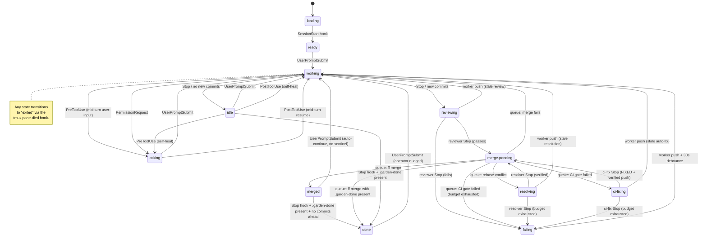
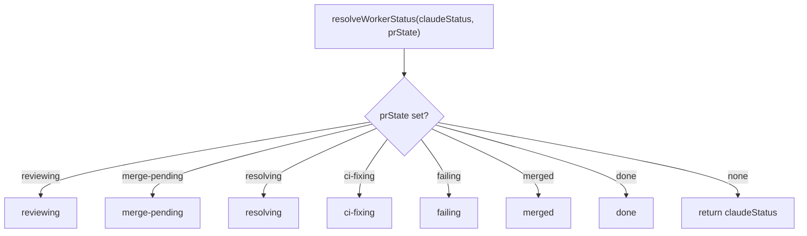
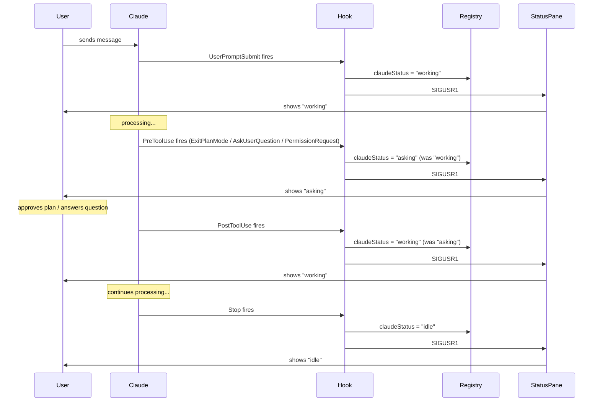

# Worker Status System

Spec for the worker status tracking and display system. This document is
the source of truth for how status works. **If the code disagrees with
this document, the code is wrong.** Past regressions came from racing
pgrep, marker files, and fallback polls; the model below is purely
event-driven and the implementation must stay that way.

## Display states

These are the only states the user sees in the status pane.

| State         | Icon | Meaning                                          |
|---------------|------|--------------------------------------------------|
| loading       | `H`  | Worker pane started, bootstrap running, Claude not yet launched. |
| ready         | `*`  | Fresh worker. Claude loaded, waiting for first input. |
| working       | `@`  | Claude is generating a response to a submitted prompt. See "What 'working' means" below. |
| asking        | `?`  | Claude is blocked mid-turn waiting for operator input — plan approval, a question answer, or a permission-request escalation. The turn has not ended. |
| idle          | `#`  | Turn has ended — Claude finished its response and is waiting at the prompt for the next user message. Not in the review cycle. |
| reviewing     | `%`  | Automated reviewer is checking the worker's code. |
| merge-pending | `&`  | Review passed. Queued for merge.                 |
| resolving     | `~`  | Automated resolver is fixing a merge-queue rebase conflict. |
| ci-fixing     | `^`  | Self-healing ci-fix agent is investigating a red GitHub Actions check on the merge candidate. |
| merged        | `+`  | Code just landed on the base branch — transient post-merge beat. Neutral color; not actionable. |
| done          | `=`  | Worker self-declared finished via the `.garden-done` sentinel. Bold green; the operator's "cleanup me" signal. |
| failing       | `x`  | Review failed. Waiting for worker to fix.        |
| exited        | `o`  | Worker process is gone.                          |

(Icons shown here are placeholders. Actual Unicode symbols are defined in
`src/commands/status.ts`.)

### What "working" means

`working` means exactly one thing: **Claude has received a submitted
prompt and has not yet finished its response.**

It starts the instant the `UserPromptSubmit` hook fires and ends the
instant the `Stop` hook fires. Nothing else flips it.

Things that *are* working:
- Generating tokens
- Running tools (Read, Bash, Edit, etc.)
- Calling subagents
- Thinking between tool calls

Things that are *not* working:
- The user typing a message at the prompt (no prompt has been submitted yet)
- The user reading Claude's last response
- Claude sitting at the prompt with nothing to do
- The session being open in a pane the user isn't looking at
- Claude waiting for the user to approve a plan or answer a question (that is `asking`, not `working`)

If a worker shows `working` while Claude is waiting for user input, that
is a bug — the PreToolUse hook for the blocking tool (`ExitPlanMode`,
`AskUserQuestion`) didn't fire or didn't reach the registry. The correct
state in that situation is `asking`.

## State transitions



The two exits from `working` via `Stop` are the core branching point:
- **No new commits** → `idle` (turn ended, ball in user's court)
- **New commits** → `reviewing` (skips idle, enters review cycle)

`working` also exits to `asking` mid-turn (PreToolUse / PermissionRequest)
when Claude needs operator input before it can continue. `asking` is not
a terminal state — it returns to `working` when the operator responds
(PostToolUse) or submits a new prompt.

### Transition rules

| From          | To            | Trigger event                                        |
|---------------|---------------|------------------------------------------------------|
| loading       | ready         | Worker `SessionStart` hook                           |
| ready         | working       | Worker `UserPromptSubmit` (first)                    |
| working       | idle          | Worker `Stop`; no new commits ahead of base          |
| working       | asking        | Worker `PreToolUse` (mid-turn user-input tool)       |
| working       | asking        | Worker `PermissionRequest`                           |
| working       | reviewing     | Worker `Stop`; new commits ahead of base             |
| idle          | working       | Worker `UserPromptSubmit`                            |
| idle          | working       | Worker `PostToolUse` (self-heal; stale idle)         |
| idle          | asking        | Worker `PreToolUse` (self-heal; stale idle)          |
| asking        | working       | Worker `UserPromptSubmit`                            |
| asking        | working       | Worker `PostToolUse` (mid-turn resume)               |
| reviewing     | merge-pending | Reviewer `Stop` with verdict CLEAN or FIXED          |
| reviewing     | failing       | Reviewer `Stop` with verdict FAILED                  |
| reviewing     | working       | Worker push event (commits during review, aborted)   |
| merge-pending | merged        | Merge queue: ff merge succeeds (no sentinel)         |
| merge-pending | done          | Merge queue: ff merge succeeds AND `.garden-done` present at merge time |
| merge-pending | resolving     | Merge queue: rebase conflict (resolver launched)     |
| merge-pending | ci-fixing     | Merge queue: CI gate failed, budget remains (ci-fix launched) |
| merge-pending | failing       | Merge queue: CI gate failed AND ci-fix budget already exhausted |
| merge-pending | working       | Merge queue: merge fails (non-conflict)              |
| resolving     | merge-pending | Resolver `Stop`, programmatic verification passed    |
| resolving     | failing       | Resolver `Stop`, budget exhausted or verification failed |
| resolving     | working       | Worker push event (commits during resolution, aborted) |
| ci-fixing     | merge-pending | ci-fix `Stop`, verdict FIXED and verified push (re-runs CI gate) |
| ci-fixing     | merge-pending | ci-fix `Stop`, retry (budget remains, no verified push) |
| ci-fixing     | failing       | ci-fix `Stop`, budget exhausted with `failingReason: "ci"` |
| ci-fixing     | working       | Worker push event (commits during auto-fix, agent aborted) |
| merged        | working       | Worker `UserPromptSubmit` (transient cleared)        |
| merged        | done          | Worker `Stop` with no commits ahead AND `.garden-done` present |
| done          | working       | Worker `UserPromptSubmit` (operator nudged)          |
| failing       | working       | Worker push event + 30s debounce                     |
| any           | exited        | tmux `pane-died` hook                                |

A worker never returns to `ready` once it has received its first input.

## How transitions are detected

Every transition above is delivered by an identifiable event from a
specific source. **There is no recurring tick. There is no fallback
poll. There is no "let's check just in case."** The poller is a pure
dispatcher: it wakes when an event arrives, runs one unit of work, and
goes back to sleep.

### Event sources

Four sources cover the entire state machine.

**1. Claude Code hooks** — `SessionStart`, `UserPromptSubmit`, `Stop`,
`PreToolUse`, `PostToolUse`.

These bracket the lifecycle of every Claude conversation and fire from
*every* Claude process: workers, reviewers, helpers. The hooks call
`garden dashboard _claude-hook <event>`, which updates the registry and
signals the status pane. They drive:

- `loading → ready` (worker's `SessionStart`)
- `ready → working`, `idle → working`, `asking → working`, `merged → working`, `done → working` (worker's `UserPromptSubmit`)
- `working → idle`, `working → reviewing` (worker's `Stop`)
- `working → asking` (worker's `PreToolUse` for user-input tools, `PermissionRequest`)
- `asking → working` (worker's `PostToolUse` for user-input tools)
- `reviewing → merge-pending`, `reviewing → failing` (reviewer's `Stop`)
- `resolving → merge-pending`, `resolving → failing` (resolver's `Stop`)
- `ci-fixing → merge-pending`, `ci-fixing → failing` (ci-fix agent's `Stop`)

The worker's `Stop` hook also pokes the project's poller FIFO if it sees
new commits ahead of the base branch — so review starts immediately,
without waiting for any tick.

**2. Worker push events** — a worker's `git push` completion pokes its
project's poller FIFO via a pre-push hook installed in each worktree.
The push is the event; the poke is the delivery.

Drives:

- `reviewing → working` (commits arrive during review, review aborted)
- `resolving → working` (commits arrive during resolution, resolver aborted)
- `ci-fixing → working` (commits arrive during auto-fix, agent aborted)
- `failing → working` (after the 30s debounce starts on the push)

**3. Merge queue completion** — an internal in-process event. When one
merge finishes, the next item in the project's serial queue is processed.
No external trigger.

Drives:

- `merge-pending → merged`
- `merge-pending → resolving` (rebase conflict)
- `merge-pending → ci-fixing` (CI gate failed; budget remains, agent dispatched)
- `merge-pending → failing` (CI gate failed; ci-fix budget already exhausted)
- `merge-pending → working` (merge fails for a non-conflict reason)
- `resolving → merge-pending` (resolver succeeded and verification passed)
- `resolving → failing` (resolver budget exhausted or verification failed)
- `ci-fixing → merge-pending` (ci-fix succeeded with verified push, or retrying within budget)
- `ci-fixing → failing` (ci-fix budget exhausted)

**4. tmux `pane-died` hook** — tmux fires this automatically when a
pane process exits. The dashboard listens and writes
`claudeStatus = "exited"` to the registry.

Drives:

- `any → exited`

### Scheduled wake-ups (deliberate, finite, event-tied)

Garden does NOT have a recurring tick. What it does have is a small set
of one-shot scheduled wake-ups (FIFO pokes for state transitions,
detached `sleep && garden dashboard …` subprocesses for delayed
prompts) — each tied to a specific event, each serving a purpose that
cannot be expressed as "wait for an event":

- **`failing → working` debounce (30 s)** — preventing review storms on
  a worker that's actively failing in a tight loop. Started on a push
  event in the failing state. Source: `poller-state.ts` DEBOUNCE_MS.
- **Reviewer / resolver wall-clock cap (60 min)** — kills a hung
  subprocess (e.g. `npm test` with no timeout, blocked by the sandbox)
  so the state machine can escalate to `failing` instead of wedging.
  Source: `poller-review.ts` REVIEW_TIMEOUT_MS, scheduled by
  `scheduleReviewTimeoutPoke` at agent launch.
- **Unparseable-verdict re-poke (0 s)** — re-arms the FIFO so the next
  poll cycle picks up the just-written `pendingReviewAt`. Logically a
  hand-off, not a wait. Source: `poller-review.ts` after the retry
  transition.
- **Auto-continue prompt delays (3 / 5 / 6 s)** — give Claude's TUI
  time to take over the pane's stdin before send-keys lands keystrokes.
  Source: `continue.ts` and `trellis-continue.ts` `dispatchDelayed*`.
- **Garden post-rebuild refresh** — fired after `npm run build`
  succeeds so the dashboard picks up the new code. Source:
  `poller-merge.ts` `runPostMerge`.

What this spec rejects is the OTHER kind of timer: the `setInterval`,
recurring re-check, or "fallback poll" that drives transitions on a
clock. Every transition above is event-triggered; the schedules are
hold-offs and hand-offs, not discovery mechanisms.

### Why this matters

A bug in this system is always a bug in event plumbing — never "the
poller didn't tick fast enough." There is no tick. If a transition
isn't reached, exactly one event was missed, and there is exactly one
place to look for it. This is what makes the state machine resistant to
the kind of timing-based regressions that have hit it in the past, and
why this spec rejects any code change that introduces a recurring poll
or "let's check just in case." Adding a new scheduled wake-up is
allowed when (a) it's tied to a specific state transition or
operator-visible signal and (b) it fires once per event, not on a
clock. Update the list above when you do.

## Key invariants

1. **`idle`/`asking` and the review cycle are mutually exclusive.** A
   worker in `reviewing`, `merge-pending`, `resolving`, `ci-fixing`, or
   `failing` never shows `idle` or `asking`. If it shows either, it is
   not in the review cycle.

2. **`working` is the only entry point to the review cycle.** The poller
   only transitions to `reviewing` when Claude stops working *and* new
   commits exist. You cannot go from `idle` directly to `reviewing`.

3. **`ready` is one-time.** Once a worker receives its first input, it
   never returns to `ready`.

4. **Active pipeline states are sticky; `merged` is transient; `done` is the cleanup signal.**
   While a worker is in `reviewing`, `merge-pending`, `resolving`,
   `ci-fixing`, or `failing`, those states take priority over what
   Claude is doing — they represent in-progress pipeline work.

   `merged` and `done` are two distinct terminal-cluster states with
   different meanings, and they MUST NOT be conflated in the renderer:

   - **`merged`** is the transient post-merge beat. `finalizeMerge`
     sets it after a clean merge when the worker has not declared
     itself finished. It exists only to give the operator a brief
     visual confirmation that a phase landed; it is cleared the moment
     the auto-continue prompt's `UserPromptSubmit` fires, and the
     worker resumes the next phase. Renderer color: neutral (not
     green). It is NOT an operator-actionable signal.

   - **`done`** means the worker invoked the `done` skill (wrote
     `.garden-done`) and the merge cycle has settled with no further
     work pending. This is the operator's "this worker is finished,
     you can clean it up" signal. Renderer color: bold green. The
     auto-continue prompt is suppressed when the sentinel is present,
     so a worker entering `done` stays there until the operator either
     cleans it up or submits a new prompt (which clears `done` →
     `working` *and* deletes `.garden-done` — so a subsequent
     no-commits Stop in the new turn does not re-trip `done` from the
     prior phase's declaration; the worker re-invokes the `done` skill
     if it is still finished).

   There are two paths into `done`:

   1. **Sentinel present at merge time** — the worker wrote
      `.garden-done` before its final push. `finalizeMerge` checks the
      sentinel and sets `prState = "done"` directly (skipping the
      transient `merged` beat). `maybeAutoContinue` independently sees
      the sentinel and skips the prompt.
   2. **Sentinel set after auto-continue** — `finalizeMerge` set
      `merged`, the auto-continue cleared it to `working`, the worker
      then decided to stop, wrote `.garden-done`, and ended its turn
      with no new commits. The Stop hook detects this combination
      (no commits ahead + `.garden-done` present) and sets
      `prState = "done"`.

   Race case: if a new prompt landed before `finalizeMerge` ran, the
   prompt hook cannot clear `merged`/`done` (because prState was still
   an active pipeline state at prompt time). `finalizeMerge` handles
   this by checking `claudeStatus` after writing the terminal state —
   if the worker is already working, it transitions immediately to
   `working`.

   There is no "merged history" — each cycle is independent. The Stop
   hook only sets `done` (never `merged`); `UserPromptSubmit` is the
   only path out of either terminal state toward active work.

5. **There is no `pushed` state.** Earlier versions of this system carried
   an internal `pushed` lifecycle state between "commits exist" and
   "reviewer launched". The current model collapses that gap: the worker's
   Stop hook sets `pendingReviewAt` (and pokes the poller FIFO) the moment
   it observes commits ahead of base, and the poller's next wake transitions
   the worker directly to `reviewing`. The window is sub-second and not
   user-visible. `pushed` does not appear in the registry, the renderer,
   or the type system.

6. **Every transition is event-triggered.** No transition is discovered
   by a recurring tick or fallback poll. The poller wakes only when
   poked by an event (a hook firing, a worker pushing, a reviewer
   exiting, a merge queue item completing) and does one unit of work.
   The system schedules one-shot wake-ups for hold-offs and hand-offs
   (failing-debounce, reviewer wall-clock cap, auto-continue delays —
   see "Scheduled wake-ups" above), but those are tied to specific
   events, not driven by a clock. No `setInterval`, no recurring
   re-check, no "let's check just in case."

7. **Resolver verdicts are not trusted — they are verified.** When a
   resolver returns a `DONE` verdict, the poller does not transition to
   `merge-pending` on the strength of the text alone. It runs three
   programmatic checks against the worktree: no rebase is in progress
   (`.git/rebase-merge` and `.git/rebase-apply` are absent),
   `origin/<base>` is an ancestor of local HEAD, and HEAD differs from
   `preResolveSha`. All three must pass. If any fails, the attempt
   counts as a failed resolution regardless of the verdict text. This
   invariant exists because Claude can (and has) declared success
   without completing the rebase — the spec makes verification the
   contract, not trust.

8. **Resolver retries have a fixed budget.** `resolveAttempts` on the
   worker entry caps the number of resolver launches per merge attempt
   at 2 (one initial + one retry). When the budget is exhausted, the
   worker transitions to `failing` and a persistent operator alert is
   raised. Budget resets to 0 on any worker-authored push (new commits
   on the branch) or on successful merge. Workers cannot silently spin
   on an unresolvable conflict.

## Detection machinery

The status of every worker is two fields in the registry: `claudeStatus`
and `prState`. There are exactly four writers and one reader. There is
no `pgrep`, no marker file, no activity-text parsing, no fallback poll.

### Writers

**Worker creation** writes `claudeStatus = "loading"` when `newWorker()`
spawns the worker pane.

**Claude Code hooks** write `claudeStatus`. The hooks fire from every
Claude process and call `garden dashboard _claude-hook <event>`:

- `SessionStart` → branches on the hook input's `source` field:
  - `startup` or `clear` → `claudeStatus = "ready"` (fresh context).
  - `resume` or `compact` → preserve `claudeStatus` if it is currently
    `working` or `asking`; otherwise set `ready`. Auto-compaction in
    particular fires SessionStart mid-turn (Claude crosses the context
    threshold and resets context while the operator's prompt is still
    being answered) — overwriting `working` here would silently strand
    the worker as "ready" in the dashboard until the next tool call or
    Stop, which is what bug-stranded workers reported pre-fix.
  - Missing/unknown `source` → `claudeStatus = "ready"` (back-compat
    with older Claude Code builds that did not emit `source`).
- `UserPromptSubmit` → `claudeStatus = "working"`. Also clears `prState`
  if it equals `merged` or `done` (this is the only place either is
  cleared).
- `Stop` → `claudeStatus = "idle"`. If commits ahead of base exist, also
  sets `pendingReviewAt = Date.now()` and pokes the project's poller FIFO
  so review begins immediately. `pendingReviewAt` is the per-worker mark
  that the Stop hook just observed new commits — without it, the poller
  cannot tell "Stop hook just fired" from "worker has been idle with
  stale commits for a month" and would spuriously review old branches.
  This is what makes invariant 2 enforceable: only Stop sets the flag,
  only the poller's working→reviewing transition reads it, and
  `launchReview` clears it.
- `PreToolUse` (matched to `AskUserQuestion`, `ExitPlanMode`) →
  `claudeStatus = "asking"` if currently `working` or `idle`. Fires when
  Claude is about to execute a tool that requires user input. The `idle`
  path is a self-heal: a user-input tool only fires mid-turn, so an
  `idle` worker at this point has a stale status (usually left over from
  a prior build that wrote this hook differently) and the event itself
  is proof of active work.
  `ExitPlanMode` is the blocking tool — it presents the plan for user
  approval. `EnterPlanMode` is non-blocking (Claude entering plan mode
  to write the plan) and must NOT be hooked, as its PreToolUse/PostToolUse
  fire during active generation and would cause spurious working↔asking
  flicker. The `Notification` hook is not used — it matches too broadly
  (all notification types, not just user-attention ones) and the
  user-input cases are fully covered by PreToolUse/PostToolUse on the
  specific tools.
- `PermissionRequest` (no matcher — all tools) →
  `claudeStatus = "asking"` (only if currently `working`). Fires when
  auto-mode's classifier escalates a tool call for operator approval —
  it is the only event that reports "a permission dialog is actually
  being shown" (unlike `PreToolUse`, which fires for every tool call
  and would flicker the dashboard on every auto-approved bash). Each
  worktree's `.claude/settings.json` sets
  `permissions.defaultMode: "auto"` so every Claude process in that
  worktree (worker, reviewer, resolver, resume) starts in auto mode
  and this hook is the one-stop signal for operator-attention-required
  events across every tool, not just Bash. No operator alert fires —
  the `asking` status (yellow row in the status pane) is the signal;
  the bottom-bar alert badge is reserved for failures and errors.
- `PostToolUse` (no matcher — fires for all tools) →
  `claudeStatus = "working"` if currently `asking` or `idle`. Fires
  when the user has responded and Claude resumes processing. The
  catch-all matcher is what restores `working` after the operator
  approves an auto-mode permission prompt — auto-mode escalates any
  tool the classifier flags (Write, Edit, Read, Bash, WebFetch, ...),
  so a narrower matcher would leave the worker stuck at `asking` for
  the rest of the turn whenever the escalated tool was not in the
  matcher list. The `idle` path is a self-heal: a tool-use event
  arriving while `idle` means the turn is actually active and the
  registry state is stale (e.g. survived a build migration that left
  `idle` behind). The practical risk — a stray PostToolUse flipping a
  genuinely-ended turn back to `working` — is a brief flicker; the
  next `Stop` re-idles within one tool round.

**The poller** writes `prState` in response to the events documented in
"How transitions are detected." The poller is the only writer of
in-progress lifecycle states (`reviewing`, `merge-pending`, `failing`,
`merged`). It also writes `done` from `finalizeMerge` when the
`.garden-done` sentinel is present at merge time. The Stop hook is the
only other writer of `done` (the post-auto-continue path).

**The tmux `pane-died` handler** writes `claudeStatus = "exited"` when
a worker pane process exits.

### Reader

The status renderer reads `claudeStatus` and `prState` from the registry
and combines them with `resolveWorkerStatus()`. There is exactly one
render path. The renderer never executes `pgrep`, never reads a marker
file, never parses activity text. If the registry says a worker is
working, it is working — full stop.

### resolveWorkerStatus



Lifecycle states (`reviewing`, `merge-pending`, `resolving`, `ci-fixing`,
`failing`, `merged`, `done`) take priority because they describe where the worker's
*code* is, not what Claude is doing right now. `merged` and `done` are
the only ones that clear on `UserPromptSubmit` — that clear is performed
by the hook handler, not by this combine function.

### Hook → display pipeline

```mermaid
sequenceDiagram
    participant User
    participant Claude
    participant Hook
    participant Registry
    participant StatusPane

    User->>Claude: sends message
    Claude->>Hook: UserPromptSubmit fires
    Hook->>Registry: claudeStatus = "working"; clear prState if "merged" or "done"
    Hook->>StatusPane: SIGUSR1
    StatusPane->>Registry: read claudeStatus + prState
    StatusPane->>User: shows "working"

    Note over Claude: processing...

    Claude->>Hook: Stop fires
    Hook->>Registry: claudeStatus = "idle"
    Hook->>StatusPane: SIGUSR1
    StatusPane->>User: shows "idle"
```

#### Mid-turn asking (plan mode, questions, permission escalations)



## Known edge cases

The legacy implementation had several edge cases driven by its
heuristic detection (subagent flicker, race between pgrep and hooks,
marker staleness). All of those go away in the event-driven model
because there is no detection — only event delivery.

The remaining failure modes are honest:

**Hook fails to fire.** If Claude crashes or Claude Code's hook plumbing
is broken, `claudeStatus` is not updated and the worker shows its last
known state. The `garden health` command detects workers whose hooks
haven't fired in an unusually long time and surfaces them to the user.
We do not auto-correct via fallback polling — that mechanism is the
exact source of the regressions this spec is meant to prevent.

**tmux `pane-died` hook missed.** If tmux fails to fire `pane-died`, an
exited worker continues to show its previous status until the next
explicit interaction. The `garden health` command detects panes whose
PIDs no longer exist and corrects the registry.
