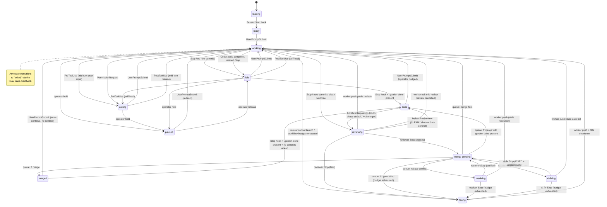
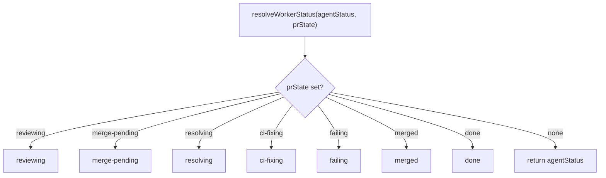

# Worker Status System

Spec for the worker status tracking and display system. This document is
the source of truth for how status works. **If the code disagrees with
this document, the code is wrong.** Past regressions came from racing
pgrep, marker files, and fallback polls; the model below is purely
event-driven and the implementation must stay that way. The sole
sanctioned recurring tick is the liveness watchdog (see "Scheduled
wake-ups" and invariant 6) — it recovers lost event *delivery* (re-poking
a project and respawning a dead poller window) but never detects status
or drives transitions.

## Display states

These are the only states the user sees in the status pane.

| State         | Icon | Meaning                                          |
|---------------|------|--------------------------------------------------|
| loading       | `H`  | Worker pane started, bootstrap running, Claude not yet launched. |
| ready         | `*`  | Fresh worker. Claude loaded, waiting for first input. |
| working       | `@`  | Claude is generating a response to a submitted prompt. See "What 'working' means" below. |
| asking        | `?`  | Claude is blocked mid-turn waiting for operator input — plan approval, a question answer, or a permission-request escalation. The turn has not ended. |
| idle          | `#`  | Turn has ended — Claude finished its response and is waiting at the prompt for the next user message. Not in the review cycle. |
| paused        | `‖`  | Operator interrupted the worker mid-turn and is holding it (the `hold` action / `⌥e`). Distinct from `idle`: the operator deliberately halted active work and intends to redirect. Cleared by the next prompt. See "Operator hold" below. |
| reviewing     | `%`  | Automated reviewer is checking the worker's code. |
| merge-pending | `&`  | Review passed. Queued for merge.                 |
| resolving     | `~`  | Automated resolver is fixing a merge-queue rebase conflict. |
| ci-fixing     | `^`  | Self-healing ci-fix agent is investigating a red GitHub Actions check on the merge candidate. |
| merged        | `+`  | Code just landed on the base branch — transient post-merge beat. Neutral color; not actionable. |
| done          | `=`  | Worker self-declared finished via the `.garden-done` sentinel. Bold green; the operator's "cleanup me" signal. |
| failing       | `x`  | Review failed. Waiting for worker to fix.        |
| exited        | `o`  | Worker process is gone.                          |

(Icons shown here are placeholders. Actual Unicode symbols are defined in
`src/commands/status.ts`.)

### What "working" means

`working` means exactly one thing: **Claude has received a submitted
prompt and has not yet finished its response.**

It starts the instant the `UserPromptSubmit` hook fires. Claude Code's
authoritative end signal is `Stop`; for Codex, the rollout's final
`task_complete` is the backstop when `Stop` is missed. Nothing heuristic
flips it.

Things that *are* working:
- Generating tokens
- Running tools (Read, Bash, Edit, etc.)
- Calling subagents
- Thinking between tool calls

Things that are *not* working:
- The user typing a message at the prompt (no prompt has been submitted yet)
- The user reading Claude's last response
- Claude sitting at the prompt with nothing to do
- The session being open in a pane the user isn't looking at
- Claude waiting for the user to approve a plan or answer a question (that is `asking`, not `working`)

If a worker shows `working` while Claude is waiting for user input, that
is a bug — the PreToolUse hook for the blocking tool (`ExitPlanMode`,
`AskUserQuestion`) didn't fire or didn't reach the registry. The correct
state in that situation is `asking`.

### Operator hold (paused)

There is one case where a worker that is *not* working can still legitimately
display `working`, and it is the reason the `paused` state exists: a **user
interrupt**. When the operator presses Escape in the worker's Claude pane, the
turn is aborted but **no hook fires** — Claude Code's `Stop` hook does not run
on a user interrupt, and there is no interrupt/abort hook at all. So the
registry never hears about the interrupt and the worker stays painted as
`working` until the operator submits a new prompt.

The `paused` state closes that gap, but only as an *operator-initiated* action,
because a raw Escape is unobservable. The `hold` action (`garden hold <worker>`
or the dashboard `⌥e` hotkey on the focused worker) does two things atomically:
it sends Escape to the worker's pane (the interrupt) and writes
`agentStatus = "paused"`. The operator action — a keystroke — is the event; it
is exactly as event-driven as a hook firing (invariant 6). `paused` means "the
operator deliberately halted this worker mid-turn and is holding it for a
redirect"; it is distinct from `idle` (turn ended naturally) in provenance and
intent, even though both sit at the prompt awaiting input.

`paused` clears the moment the operator submits their redirect
(`UserPromptSubmit → working`), the same path that clears `merged`/`done`. The
dashboard `⌥e` hotkey also toggles: pressing it on an already-held worker
releases it back to `idle` (the "never mind" path) without sending a prompt.

## State transitions



The two normal exits from `working` via `Stop` are the core branching point:
- **No new commits** → `idle` (turn ended, ball in user's court)
- **New commits + clean worktree** → `reviewing` (skips idle, enters review cycle)
- **New commits + dirty worktree** → `idle`, review NOT queued. Uncommitted
  tracked or untracked changes mean the agent stopped mid-work (e.g. paused
  to answer an operator question with WIP on disk); the reviewer certifies
  the committed snapshot of that same worktree, so reviewing now would
  certify a stale tree and force-push under live edits. An indeterminate
  cleanliness check fails closed the same way. The next clean-tree `Stop`
  re-arms the review.

`working` also exits to `asking` mid-turn (PreToolUse / PermissionRequest)
when Claude needs operator input before it can continue. `asking` is not
a terminal state — it returns to `working` when the operator responds
(PostToolUse) or submits a new prompt.

### Transition rules

| From          | To            | Trigger event                                        |
|---------------|---------------|------------------------------------------------------|
| loading       | ready         | Worker `SessionStart` hook                           |
| ready         | working       | Worker `UserPromptSubmit` (first)                    |
| working       | idle          | Worker `Stop`; no new commits ahead of base          |
| working       | idle          | Worker `Stop`; commits ahead but the worktree has uncommitted (or indeterminate) changes — review not queued; the next clean-tree `Stop` re-arms |
| working       | idle          | Codex rollout's final `task_complete`; `Stop` missed |
| working       | asking        | Worker `PreToolUse` (mid-turn user-input tool)       |
| working       | asking        | Worker `PermissionRequest`                           |
| working       | reviewing     | Worker `Stop`; new commits ahead of base, worktree clean |
| working       | failing       | Assembled review prompt exceeds the context ceiling even with the diff reduced to a file summary — `failingReason: "oversized-diff"`, no reviewer launched |
| working       | failing       | Workflow iteration budget is exhausted before a reviewer can launch |
| idle          | working       | Worker `UserPromptSubmit`                            |
| idle          | working       | Worker `PostToolUse` (self-heal; stale idle)         |
| idle          | asking        | Worker `PreToolUse` (self-heal; stale idle)          |
| asking        | working       | Worker `UserPromptSubmit`                            |
| asking        | working       | Worker `PostToolUse` (mid-turn resume)               |
| working       | paused        | Operator `hold` action (`garden hold` / `⌥e`)        |
| asking        | paused        | Operator `hold` action                               |
| idle          | paused        | Operator `hold` action                               |
| paused        | working       | Worker `UserPromptSubmit` (operator's redirect)      |
| paused        | idle          | Operator release (`⌥e` toggle on a held worker)      |
| reviewing     | merge-pending | Reviewer `Stop` with verdict CLEAN or FIXED          |
| reviewing     | done          | Holistic final review `Stop`: CLEAN / shadow / no-commit (interposed whole-task pass) |
| reviewing     | failing       | Reviewer `Stop` with verdict FAILED                  |
| reviewing     | working       | Worker push event (commits during review, aborted)   |
| reviewing     | working       | Worker ran a mutating tool (Edit/Write) mid-review — the reviewer shares the worktree, so the pass is cancelled and re-armed for the worker's next quiescence. Applies to the holistic pass too (its markers clear; the gate re-evaluates at the next terminal state). Read-only activity (an operator Q&A turn) leaves the review running. |
| merge-pending | merged        | Merge queue: ff merge succeeds (no sentinel)         |
| merge-pending | done          | Merge queue: ff merge succeeds AND `.garden-done` present at merge time |
| merge-pending | resolving     | Merge queue: rebase conflict (resolver launched)     |
| merge-pending | ci-fixing     | Merge queue: CI gate failed, budget remains (ci-fix launched) |
| merge-pending | failing       | Merge queue: CI gate failed AND ci-fix budget already exhausted |
| merge-pending | working       | Merge queue: merge fails (non-conflict)              |
| resolving     | merge-pending | Resolver `Stop`, programmatic verification passed    |
| resolving     | failing       | Resolver `Stop`, budget exhausted or verification failed |
| resolving     | working       | Worker push event (commits during resolution, aborted) |
| ci-fixing     | merge-pending | ci-fix `Stop`, verdict FIXED and verified push (re-runs CI gate) |
| ci-fixing     | merge-pending | ci-fix `Stop`, retry (budget remains, no verified push) |
| ci-fixing     | failing       | ci-fix `Stop`, budget exhausted with `failingReason: "ci"` |
| ci-fixing     | working       | Worker push event (commits during auto-fix, agent aborted) |
| merged        | working       | Worker `UserPromptSubmit` (transient cleared)        |
| merged        | done          | Worker `Stop` with no commits ahead AND `.garden-done` present |
| done          | working       | Worker `UserPromptSubmit` (operator nudged)          |
| done          | reviewing     | Holistic interposition: multi-phase default worker (≥2 merges) — poller launches whole-task review |
| failing       | working       | Worker push event + 30s debounce                     |
| any           | exited        | tmux `pane-died` hook                                |

A worker never returns to `ready` once it has received its first input.

Poller-driven `prState` changes are compare-and-set operations. `transitionState`
reads the current worker entry, validates the edge against that worker's workflow,
and persists the new state and related fields under one registry lock. An edge
that is no longer valid because another process advanced the worker is rejected
without writing; explicit recovery code must opt into `forceTransitionState`.
This keeps the table above executable rather than advisory.

## How transitions are detected

Every transition above is delivered by an identifiable event from a
specific source. **No recurring tick drives a transition; no fallback
poll discovers state; there is no "let's check just in case."** The
poller is a pure dispatcher: it wakes when an event arrives, runs one
unit of work, and goes back to sleep. (The single recurring tick in the
system — the liveness watchdog — only restores lost event *delivery*:
it re-delivers a lost poke and respawns a poller window that died so
pokes can land again. It discovers nothing and transitions nothing. See
"Scheduled wake-ups" and invariant 6.)

### Event sources

Five sources cover the entire state machine.

**1. Claude Code hooks** — `SessionStart`, `UserPromptSubmit`, `Stop`,
`PreToolUse`, `PostToolUse`.

These bracket the lifecycle of every Claude conversation and fire from
*every* Claude process: workers, reviewers, helpers. The hooks call
`garden dashboard _claude-hook <event>`, which updates the registry and
signals the status pane. They drive:

- `loading → ready` (worker's `SessionStart`)
- `ready → working`, `idle → working`, `asking → working`, `merged → working`, `done → working` (worker's `UserPromptSubmit`)
- `working → idle`, `working → reviewing` (worker's `Stop`)
- `working → asking` (worker's `PreToolUse` for user-input tools, `PermissionRequest`)
- `asking → working` (worker's `PostToolUse` for user-input tools)
- `reviewing → merge-pending`, `reviewing → failing` (reviewer's `Stop`)
- `reviewing → working` (worker's `PostToolUse` for a mutating tool while the
  review is in flight: the hook stamps `reviewInterruptedAt` and pokes the
  poller, which kills the reviewer and cancels the pass — hooks write
  `agentStatus`, the poller writes `prState`)
- `resolving → merge-pending`, `resolving → failing` (resolver's `Stop`)
- `ci-fixing → merge-pending`, `ci-fixing → failing` (ci-fix agent's `Stop`)

The worker's `Stop` hook also pokes the project's poller FIFO if it sees
new commits ahead of the base branch on a clean worktree — so review starts
immediately, without waiting for any tick. A dirty or indeterminate worktree
does not queue review.

**2. Worker push events** — a worker's `git push` completion pokes its
project's poller FIFO via a pre-push hook installed in each worktree.
The push is the event; the poke is the delivery.

Drives:

- `reviewing → working` (commits arrive during review, review aborted)
- `resolving → working` (commits arrive during resolution, resolver aborted)
- `ci-fixing → working` (commits arrive during auto-fix, agent aborted)
- `failing → working` (after the 30s debounce starts on the push)

**3. Merge queue completion** — an internal in-process event. When one
merge finishes, the next item in the project's serial queue is processed.
No external trigger.

Drives:

- `working → failing` (assembled review prompt over the context ceiling; no reviewer launched)
- `merge-pending → merged`
- `merge-pending → resolving` (rebase conflict)
- `merge-pending → ci-fixing` (CI gate failed; budget remains, agent dispatched)
- `merge-pending → failing` (CI gate failed; ci-fix budget already exhausted)
- `merge-pending → working` (merge fails for a non-conflict reason)
- `resolving → merge-pending` (resolver succeeded and verification passed)
- `resolving → failing` (resolver budget exhausted or verification failed)
- `ci-fixing → merge-pending` (ci-fix succeeded with verified push, or retrying within budget)
- `ci-fixing → failing` (ci-fix budget exhausted)

**4. tmux `pane-died` hook** — tmux fires this automatically when a
pane process exits. The dashboard listens and writes
`agentStatus = "exited"` to the registry.

Drives:

- `any → exited`

**5. Operator hold action** — `garden hold <worker>` or the dashboard `⌥e`
hotkey. The operator keystroke is the event: it sends Escape to the worker's
pane (interrupting the live turn) and writes `agentStatus = "paused"`. This is
the only operator-initiated state writer, and it exists because a user
interrupt is invisible to every Claude Code hook (see "Operator hold (paused)"
above). It is not a clock or a poll — it fires once per operator action, so it
respects invariant 6 exactly as a hook does.

Drives:

- `working → paused`, `asking → paused`, `idle → paused` (hold)
- `paused → idle` (release; the `⌥e` toggle on an already-held worker)

The exit from `paused` toward active work is owned by the hook source, not this
one: `paused → working` fires on the worker's `UserPromptSubmit` when the
operator submits their redirect.

### Scheduled wake-ups (deliberate, finite, event-tied)

Garden has exactly one recurring tick — the liveness watchdog
described at the end of this section. Everything else is a small set
of one-shot scheduled wake-ups (FIFO pokes for state transitions,
detached `sleep && garden dashboard …` subprocesses for delayed
prompts) — each tied to a specific event, each serving a purpose that
cannot be expressed as "wait for an event":

- **`failing → working` debounce (30 s)** — preventing review storms on
  a worker that's actively failing in a tight loop. Started on a push
  event in the failing state. Source: `poller-state.ts` DEBOUNCE_MS.
- **Reviewer / resolver wall-clock cap (60 min)** — kills a hung
  subprocess (e.g. `npm test` with no timeout, blocked by the sandbox)
  so the state machine can escalate to `failing` instead of wedging.
  Source: `poller-review.ts` REVIEW_TIMEOUT_MS, scheduled by
  `scheduleReviewTimeoutPoke` at agent launch. This cap is wall-clock
  (`Date.now() - reviewStartedAt`), so machine sleep would otherwise count
  as elapsed and kill a healthy reviewer on wake; the watchdog's
  `absorbSleep` detects a suspend from its own fixed-cadence overrun and
  shifts `reviewStartedAt` forward by the slippage, discounting the sleep.
  An awake-time hang still times out (the anchor is only shifted on an
  actual suspend).
- **Unparseable-verdict re-poke (0 s)** — re-arms the FIFO so the next
  poll cycle picks up the just-written `pendingReviewAt`. Logically a
  hand-off, not a wait. Source: `poller-review.ts` after the
  reviewer-committed-work re-queue transition.
- **Unparseable-verdict no-commit retry (15 s, budget 2)** — when the
  reviewer ends its turn without a parseable verdict AND committed
  nothing, the diff is unchanged and usually fine (a benign reviewer
  flake), so `handleUnparseableReview` re-queues the review on a short
  flat backoff before escalating to `failing`/"unparseable-verdict".
  Tied to the reviewer-exit event, one poke per retry, bounded budget —
  the same shape as the transient/quota ladders. Source:
  `poller-review.ts` `MAX_UNPARSEABLE_REVIEW_RETRIES`. Before this
  re-review runs (default workflow only), a synchronous **Haiku
  verdict-extraction** step (`extractReviewVerdict`, `verdict-extract.ts`,
  45 s hard timeout) reads the reviewer's own output and recovers the
  verdict when it was present but unparseable; a recovered verdict
  dispatches normally, so the re-review here fires only when the
  classifier also can't determine one.
- **Auto-continue prompt delays (3 / 5 / 6 s)** — give Claude's TUI
  time to take over the pane's stdin before send-keys lands keystrokes.
  Source: `continue.ts` and `trellis-continue.ts` `dispatchDelayed*`.
- **Garden post-rebuild refresh** — fired after `npm run build`
  succeeds so the dashboard picks up the new code. Source:
  `poller-merge.ts` `runPostMerge`.
- **Auto-continue gate-reset wake** — when the gate is paused with
  `resumeAfterReset` armed and `pausedUntil` has passed, the usage
  poller (already awake on its own cadence to refresh the quota
  snapshot) pokes every project poller so merged-state sweeps perform
  the auto-resume and replay stranded continue prompts. Tied to the
  usage-window reset event; goes quiescent once the flip clears
  `pausedUntil`. `garden auto on` / `garden auto resume-on-reset on`
  fire the same poke directly. Source: `usage-poller.ts`
  `pokeOnGateReset`, `commands/auto.ts` `wakePollers`.
- **Holistic-review interposition (one-shot, terminal-tied)** — when a
  multi-phase default worker reaches `done` with `mergeCount >= 2` and the
  project's `holisticReview` is `shadow`/`fix`, the poller interposes one
  whole-task review by re-opening `done` → `reviewing` on the worker itself
  (reusing the headless reviewer flow — NOT a spawned worker). Fired on the
  merge/done terminal event, made once-per-completion by the
  `holisticReviewedThroughMergeCount` high-water guard. When deferred (the
  worker's own Claude still working, or the shared usage gate closed), the
  guard is left UNSET so the dispatch re-attempts on the next merged/done
  sweep poke (including `pokeOnGateReset`) — no new wake-up, it rides the
  existing event. Source: `poller-holistic-review.ts`
  `maybeDispatchHolisticReview`.
- **Liveness watchdog (staleness backstop)** — a dedicated long-lived
  window (`_garden-watchdog`) ticks every 60 s and performs two recovery
  actions, neither of which transitions worker state. (1) It re-pokes any
  project holding a worker in a *poller-owed* state (the `pollerOwed`
  states in `PR_STATE_KIND`, `registry.ts`: `reviewing`, `resolving`,
  `ci-fixing`, `merge-pending`, `merged`; plus two stranding sub-states in
  otherwise-quiescent states — `working` with `pendingReviewAt` set, and
  `failing` mid-debounce, where an operator's pushed fix advanced `lastSeenSha`
  past the pinned `failingSha` so a debounced failing→working poke is owed
  (operator-action dispositions — `trellis-flagged`/`iteration-budget`/
  `stagnation` — are excluded, they stay parked)) whose latest activity
  timestamp has aged past a
  5 min threshold, recovering dropped one-shot events (a poke lost in the
  poller kill→spawn gap, a reboot-killed detached delayed poke, a dropped
  review-launch poke) by re-delivering the same FIFO poke the lost event
  would have sent. A worker in a `windowed` poller-owed state (`reviewing`,
  `resolving`, `ci-fixing`) whose hidden tmux window is still alive is in
  flight, not stranded — its work is bounded by `REVIEW_TIMEOUT_MS`, not the
  staleness threshold — so it is exempt: a live window is proof the event was
  not dropped, and the genuine stranding class (window exited, completion poke
  lost) has a dead window and still trips. Poking is damped to at most one poke
  per project per threshold, and the genuinely quiescent states (an idle
  `working` with no pending review, a *parked* `failing` with no pushed fix,
  `done`) are never watched, so a settled garden produces zero pokes. (2) It keeps each
  project's `_<project>-poller` window healthy: exactly one must be live —
  a poke is useless if no poller is reading the FIFO, and several pollers
  on one FIFO split the pokes between them and double-run lifecycle work.
  A poller window can vanish uncleanly (collateral from a
  worker-kill/worktree-cleanup, a lost tmux pane, an OS signal) outside the
  `stopProjectPoller` path that normally logs and only fires on last-worker
  removal; once gone it is otherwise revived only by a dashboard re-attach
  (`validate`) or a worker-create (`ensureProjectPoller`), so the watchdog
  respawns it. Conversely a spawn race (a post-rebuild restart overlapping
  this respawn) can leave *duplicate* same-named windows; the watchdog
  collapses them to one. Both are delivered by calling the convergent
  `startProjectPoller` for every project each tick — it spawns when none
  exists, collapses duplicates to one, and no-ops when exactly one is live.
  Window liveness is resolved by index, not by name: a tmux name target is
  ambiguous once duplicates exist (`can't find window`), so the old
  name-based liveness probe reported duplicated pollers as dead and
  respawned one every tick — an unbounded window leak. Self-damping (a
  healthy project no-ops) and, like the re-poke, restores event *delivery*
  without discovering or driving any transition. Source: `watchdog.ts`.

What this spec rejects is the OTHER kind of timer: the `setInterval`,
recurring re-check, or "fallback poll" that drives transitions on a
clock. Every transition above is event-triggered; the schedules are
hold-offs and hand-offs, not discovery mechanisms. The watchdog
respects the same line — it discovers nothing and transitions nothing.
Its two actions only restore event *delivery*: re-delivering a poke, and
respawning a poller window that died so pokes can land at all. The
event-driven handlers still decide what, if anything, a poke means.

### Why this matters

A bug in this system is always a bug in event plumbing — never "the
poller didn't tick fast enough." If a transition isn't reached, exactly
one event was missed, and there is exactly one place to look for it.
The liveness watchdog does not change that diagnosis — it bounds the
blast radius: a missed event now costs minutes of delay instead of an
indefinitely stranded worker, but the missed event is still the bug and
still worth finding (the watchdog's "poked stale project" log line is
the breadcrumb). This is what makes the state machine resistant to the
kind of timing-based regressions that have hit it in the past, and why
this spec rejects any code change that introduces a recurring poll that
drives transitions on a clock or any "let's check just in case" beyond
the single sanctioned liveness watchdog. Adding a new scheduled
wake-up is allowed when (a) it's tied to a specific state transition or
operator-visible signal and (b) it fires once per event, not on a
clock. Update the list above when you do.

## Key invariants

1. **`idle`/`asking` and the review cycle are mutually exclusive.** A
   worker in `reviewing`, `merge-pending`, `resolving`, `ci-fixing`, or
   `failing` never shows `idle` or `asking`. If it shows either, it is
   not in the review cycle.

2. **`working` is the only entry point to the review cycle.** The poller
   only transitions to `reviewing` when Claude stops working *and* new
   commits exist. You cannot go from `idle` directly to `reviewing`.

3. **`ready` is one-time.** Once a worker receives its first input, it
   never returns to `ready`.

4. **Active pipeline states are sticky; `merged` is transient; `done` is the cleanup signal.**
   While a worker is in `reviewing`, `merge-pending`, `resolving`,
   `ci-fixing`, or `failing`, those states take priority over what
   Claude is doing — they represent in-progress pipeline work.

   `merged` and `done` are two distinct terminal-cluster states with
   different meanings, and they MUST NOT be conflated in the renderer:

   - **`merged`** is the transient post-merge beat. `finalizeMerge`
     sets it after a clean merge when the worker has not declared
     itself finished. It exists only to give the operator a brief
     visual confirmation that a phase landed; it is cleared the moment
     the auto-continue prompt's `UserPromptSubmit` fires, and the
     worker resumes the next phase. Renderer color: neutral (not
     green). It is NOT an operator-actionable signal.

     A worker can park in `merged` when the auto-continue prompt never
     lands — the global gate was closed at merge time, or the paste was
     lost. The merged-state handler replays the auto-continue decision
     on every poke (the gate-reopen sweep), so the first poke after the
     gate reopens delivers the stranded prompt. The sweep uses a wider
     idempotency window than the merge-time dispatch (so it never
     double-prompts against a delivery still in flight) and skips
     workers whose Claude process has exited.

   - **`done`** means the worker invoked the `done` skill (wrote
     `.garden-done`) and the merge cycle has settled with no further
     work pending. This is the operator's "this worker is finished,
     you can clean it up" signal. Renderer color: bold green. The
     auto-continue prompt is suppressed when the sentinel is present,
     so a worker entering `done` stays there until the operator either
     cleans it up or submits a new prompt (which clears `done` →
     `working` *and* deletes `.garden-done` — so a subsequent
     no-commits Stop in the new turn does not re-trip `done` from the
     prior phase's declaration; the worker re-invokes the `done` skill
     if it is still finished).

   There are two paths into `done`:

   1. **Sentinel present at merge time** — the worker wrote
      `.garden-done` before its final push. `finalizeMerge` checks the
      sentinel and sets `prState = "done"` directly (skipping the
      transient `merged` beat). `maybeAutoContinue` independently sees
      the sentinel and skips the prompt.
   2. **Sentinel set after auto-continue** — `finalizeMerge` set
      `merged`, the auto-continue cleared it to `working`, the worker
      then decided to stop, wrote `.garden-done`, and ended its turn
      with no new commits. The Stop hook detects this combination
      (no commits ahead + `.garden-done` present) and sets
      `prState = "done"`, then pokes the project poller once so
      `handleDone` runs. This path bypasses `transitionToTerminal`
      (the merge-driven path), so the poke is the only way `handleDone`
      can fire the trail-off holistic-review trigger for a multi-phase
      worker that finished without a final merge (see the holistic-review
      workflow). The poke is one-shot (tied to the Stop-hook done write),
      not a clock tick, so it respects invariant 6.

   Race case: if a new prompt landed before `finalizeMerge` ran, the
   prompt hook cannot clear `merged`/`done` (because prState was still
   an active pipeline state at prompt time). `finalizeMerge` handles
   this by checking `agentStatus` after writing the terminal state —
   if the worker is already working, it transitions immediately to
   `working`.

   There is no "merged history" — each cycle is independent. The Stop
   hook only sets `done` (never `merged`); `UserPromptSubmit` is the
   only path out of either terminal state toward active work.

5. **There is no `pushed` state.** Earlier versions of this system carried
   an internal `pushed` lifecycle state between "commits exist" and
   "reviewer launched". The current model collapses that gap: the worker's
   Stop hook sets `pendingReviewAt` (and pokes the poller FIFO) the moment
   it observes commits ahead of base on a clean worktree, and the poller's
   next wake transitions the worker directly to `reviewing`. The window is
   sub-second and not user-visible. `pushed` does not appear in the registry,
   the renderer, or the type system.

6. **Every transition is event-triggered.** No transition is discovered
   by a recurring tick or fallback poll. The poller wakes only when
   poked by an event (a hook firing, a worker pushing, a reviewer
   exiting, a merge queue item completing, an operator holding a worker)
   and does one unit of work.
   The system schedules one-shot wake-ups for hold-offs and hand-offs
   (failing-debounce, reviewer wall-clock cap, auto-continue delays —
   see "Scheduled wake-ups" above), but those are tied to specific
   events, not driven by a clock. One bounded exception exists: the
   liveness watchdog (`watchdog.ts`, see "Scheduled wake-ups")
   re-pokes projects whose workers are stranded in active states past
   a staleness threshold and keeps each project's poller window healthy
   (respawning a dead one, collapsing duplicates a spawn race left). It is a
   backstop, not a scheduler — it only restores lost event *delivery*
   (the ordinary FIFO poke a lost event would have sent, or a poller
   process that can receive one) and never transitions state itself; the
   event-driven handlers do all the work, idempotently. Events remain the
   only fast path, and no transition is *discovered* by a clock — a
   watchdog tick that finds nothing wrong is a no-op.

7. **Resolver verdicts are not trusted — they are verified.** When a
   resolver returns a `DONE` verdict, the poller does not transition to
   `merge-pending` on the strength of the text alone. It runs three
   programmatic checks against the worktree: no rebase is in progress
   (`.git/rebase-merge` and `.git/rebase-apply` are absent),
   `origin/<base>` is an ancestor of local HEAD, and HEAD differs from
   `preResolveSha`. All three must pass. If any fails, the attempt
   counts as a failed resolution regardless of the verdict text. This
   invariant exists because Claude can (and has) declared success
   without completing the rebase — the spec makes verification the
   contract, not trust.

8. **Resolver retries have a fixed budget.** `resolveAttempts` on the
   worker entry caps the number of resolver launches per merge attempt
   at 2 (one initial + one retry). When the budget is exhausted, the
   worker transitions to `failing` and a persistent operator alert is
   raised. Budget resets to 0 on any worker-authored push (new commits
   on the branch) or on successful merge. Workers cannot silently spin
   on an unresolvable conflict.

## Detection machinery

The status of every worker is two fields in the registry: `agentStatus`
and `prState`. There are exactly five writers and one reader. There is
no `pgrep`, no marker file, no activity-text parsing, no fallback poll.

### Writers

**Worker creation** writes `agentStatus = "loading"` when `newWorker()`
spawns the worker pane.

**Claude Code hooks** write `agentStatus`. The hooks fire from every
Claude process and call `garden dashboard _claude-hook <event>`:

- `SessionStart` → branches on the hook input's `source` field:
  - `startup` or `clear` → `agentStatus = "ready"` (fresh context).
  - `resume` or `compact` → **preserve** the existing `agentStatus`; the
    hook writes nothing (self-healing only a missing value to `idle`).
    SessionStart *does* fire on `--resume` (source=`resume`), so this is
    the load-bearing case: writing `ready` here would violate the
    one-time-`ready` invariant and strand every resumed worker
    (idle/paused/asking/done) in the "new" band on each dashboard
    rebuild. On a rebuild or bounce the resume dispatcher (`create.ts` /
    `bounceWorker`, via `resolveResumeAgentStatus`) has already written
    the authoritative post-resume status — `idle` at the prompt, `ready`
    only as the cold-start sentinel for an interrupted worker it is also
    re-prompting, or a preserved `paused`/`asking`. Auto-compaction fires
    SessionStart mid-turn (Claude crosses the context threshold while the
    operator's prompt is still being answered); preserving `working`
    there is what keeps it from being stranded as `ready`.
  - Missing/unknown `source` → `agentStatus = "ready"` (back-compat
    with older Claude Code builds that did not emit `source`).
- `UserPromptSubmit` → `agentStatus = "working"`. Also clears `prState`
  if it equals `merged` or `done` (this is the only place either is
  cleared).
- `Stop` → `agentStatus = "idle"`. If commits ahead of base exist AND the
  worktree is clean (`git status --porcelain` empty — no tracked or
  untracked changes), also sets `pendingReviewAt = Date.now()` and pokes
  the project's poller FIFO so review begins immediately. A dirty tree
  means the agent stopped mid-work (paused to answer an operator question
  with WIP on disk), so queuing would review a stale committed snapshot;
  the queue is skipped and the next clean-tree `Stop` re-arms. An
  indeterminate cleanliness check fails closed the same way.
  `pendingReviewAt` is the per-worker mark
  that the Stop hook just observed new commits — without it, the poller
  cannot tell "Stop hook just fired" from "worker has been idle with
  stale commits for a month" and would spuriously review old branches.
  This is what makes invariant 2 enforceable: only Stop sets the flag,
  only the poller's working→reviewing transition reads it, and
  `launchReview` clears it. Because the flag can outlive the clean tree
  it was set on (a later turn dirties the worktree; that turn's dirty
  `Stop` skips re-arming but cannot unset the stale flag),
  `handleWorking` re-checks cleanliness at the launch point and defers —
  leaving `pendingReviewAt` set — until the tree is provably clean. If
  instead there are no commits ahead and `.garden-done` is present
  (invariant 4 path 2), the Stop hook writes
  `prState = "done"` and pokes the poller once so `handleDone` runs the
  trail-off holistic-review trigger.
- `PreToolUse` (matched to `AskUserQuestion`, `ExitPlanMode`) →
  `agentStatus = "asking"` if currently `working` or `idle`. Fires when
  Claude is about to execute a tool that requires user input. The `idle`
  path is a self-heal: a user-input tool only fires mid-turn, so an
  `idle` worker at this point has a stale status (usually left over from
  a prior build that wrote this hook differently) and the event itself
  is proof of active work.
  `ExitPlanMode` is the blocking tool — it presents the plan for user
  approval. `EnterPlanMode` is non-blocking (Claude entering plan mode
  to write the plan) and must NOT be hooked, as its PreToolUse/PostToolUse
  fire during active generation and would cause spurious working↔asking
  flicker. The `Notification` hook is not used — it matches too broadly
  (all notification types, not just user-attention ones) and the
  user-input cases are fully covered by PreToolUse/PostToolUse on the
  specific tools.
- `PermissionRequest` (no matcher — all tools) →
  `agentStatus = "asking"` (only if currently `working`). Fires when
  auto-mode's classifier escalates a tool call for operator approval —
  it is the only event that reports "a permission dialog is actually
  being shown" (unlike `PreToolUse`, which fires for every tool call
  and would flicker the dashboard on every auto-approved bash). Each
  worktree's `.claude/settings.json` sets
  `permissions.defaultMode: "auto"` so every Claude process in that
  worktree (worker, reviewer, resolver, resume) starts in auto mode
  and this hook is the one-stop signal for operator-attention-required
  events across every tool, not just Bash. No operator alert fires —
  the `asking` status (yellow row in the status pane) is the signal;
  the bottom-bar alert badge is reserved for failures and errors.
- `PostToolUse` (no matcher — fires for all tools) →
  `agentStatus = "working"` if currently `asking` or `idle`. Fires
  when the user has responded and Claude resumes processing. The
  catch-all matcher is what restores `working` after the operator
  approves an auto-mode permission prompt — auto-mode escalates any
  tool the classifier flags (Write, Edit, Read, Bash, WebFetch, ...),
  so a narrower matcher would leave the worker stuck at `asking` for
  the rest of the turn whenever the escalated tool was not in the
  matcher list. The `idle` path is a self-heal: a tool-use event
  arriving while `idle` means the turn is actually active and the
  registry state is stale (e.g. survived a build migration that left
  `idle` behind). The practical risk — a stray PostToolUse flipping a
  genuinely-ended turn back to `working` — is a brief flicker; the
  next `Stop` re-idles within one tool round.
  This hook is also the one place a hook writes a field other than
  `agentStatus`: when the tool was a *mutating* one (`Edit` / `MultiEdit`
  / `Write` / `NotebookEdit` — `Bash` is deliberately exempt, so a
  read-only Q&A turn costs nothing) and the worker's `prState` is
  `reviewing`, it stamps `reviewInterruptedAt` and pokes the poller. It
  still does not write `prState`: the cancel is the poller's, in
  `handleReviewing`. The marker is stamped once per pass and cleared by
  the cancel and by every review launch.
- Codex `request_user_input` rollout state → `agentStatus = "asking"`
  while the latest call has no matching `function_call_output`, then
  `agentStatus = "working"` once that result arrives. Codex 0.147 does
  not emit `PreToolUse` for this built-in plan-mode tool, so the watchdog
  owns an `fs.watch` listener on `$CODEX_HOME/sessions` and reconciles the
  changed rollout instead of polling. The completion only clears an
  `asking` transition older than that result, so a later permission prompt
  cannot be mistaken for the plan-mode question completing. As on the
  Claude path, the bold-yellow row and plot flag are the signal; this is
  not an alert-store failure.
- Codex rollout turn end → `agentStatus = "idle"` when a `working` worker's
  rollout has no `response_item` after its newest `task_complete`. Unlike
  Claude Code's, Codex's `Stop` hook is **not** reliably the last event of a
  turn: Codex emits `task_complete` several times per operator turn and fires
  `Stop` on only some of them, while `PostToolUse` keeps firing for tool calls
  that land after a `Stop`. When the final tool activity follows the turn's
  last `Stop`, `agentStatus` is left at `working` with no hook remaining to
  clear it — the worker is parked at its prompt, so nothing fires unprompted.
  Codex's own record is therefore the authoritative turn-end signal, read by
  the same `fs.watch` listener. The freshness guard compares `lastEventAt`,
  **not** `lastStateChangeAt`: the latter is stamped by `prState` transitions
  too, so a stalled worker that reached `merge-pending` carries a
  `lastStateChangeAt` newer than the turn end it needs recognized, which would
  put the heal permanently out of reach for exactly the workers that need it.
  A successful heal also pokes the project's poller, as the normal `Stop` path
  does, so a deferred merge gate re-evaluates immediately rather than waiting
  for the watchdog's lost-delivery backstop.
  Observed 2026-08-09: a wolf worker held `merge-pending` for 30 hours because
  `handleMergePending` will not touch a worktree it believes an agent is
  editing, and that defer is logged at debug only.

**The poller** writes `prState` in response to the events documented in
"How transitions are detected." The poller is the only writer of
in-progress lifecycle states (`reviewing`, `merge-pending`, `failing`,
`merged`). It also writes `done` from `finalizeMerge` when the
`.garden-done` sentinel is present at merge time. The Stop hook is the
only other writer of `done` (the post-auto-continue path).

**The tmux `pane-died` handler** writes `agentStatus = "exited"` when
a worker pane process exits.

**The holistic-review dispatcher** (`poller-holistic-review.ts`) writes the
per-worker holistic *bookkeeping* fields on the worker's entry — `mergeCount`,
`baseBranchSha`, `holisticTouchedFiles`, `holisticReviewedThroughMergeCount`,
`holisticRationale` — and, when it launches the interposed final review,
transitions the worker `done` → `reviewing` (via `transitionState`) with the
transient markers `holisticFinalActive` / `holisticReviewMode`. It is NOT a
separate worker: the same entry rides one headless reviewer pass in its
`_<project>-review-<worker>` window. `handleHolisticFinalReview`
(`poller-review.ts`) then drives the verdict — `reviewing` → `done` (CLEAN /
shadow findings surfaced as an alert), → `merge-pending` (a fix, which
`transitionToTerminal` finalizes to `done`), or → `failing` (an unfixable
cross-phase defect). The `done` → `reviewing` and `reviewing` → `done` edges
exist only for this interposition (see `workflows/types.ts`).

**The operator `hold` action** writes `agentStatus = "paused"` (and, on
release, `idle`). This is the only operator-initiated writer of either field;
it is driven by `garden hold <worker>` or the dashboard `⌥e` hotkey
(`holdActiveWorker` / `holdWorker` in `workers.ts`), not by any hook or tick.
It exists because a user interrupt is invisible to every Claude Code hook, so
the only way `paused` can be reached is an explicit operator action. `paused`
is never written by a hook; it is cleared by one (`UserPromptSubmit → working`).

### Reader

The status renderer reads `agentStatus` and `prState` from the registry
and combines them with `resolveWorkerStatus()`. There is exactly one
render path. The renderer never executes `pgrep`, never reads a marker
file, never parses activity text. If the registry says a worker is
working, it is working — full stop.

### resolveWorkerStatus



Lifecycle states (`reviewing`, `merge-pending`, `resolving`, `ci-fixing`,
`failing`, `merged`, `done`) take priority because they describe where the worker's
*code* is, not what Claude is doing right now. `merged` and `done` are
the only ones that clear on `UserPromptSubmit` — that clear is performed
by the hook handler, not by this combine function.

### Hook → display pipeline

```mermaid
sequenceDiagram
    participant User
    participant Claude
    participant Hook
    participant Registry
    participant StatusPane

    User->>Claude: sends message
    Claude->>Hook: UserPromptSubmit fires
    Hook->>Registry: agentStatus = "working"; clear prState if "merged" or "done"
    Hook->>StatusPane: SIGUSR1
    StatusPane->>Registry: read agentStatus + prState
    StatusPane->>User: shows "working"

    Note over Claude: processing...

    Claude->>Hook: Stop fires
    Hook->>Registry: agentStatus = "idle"
    Hook->>StatusPane: SIGUSR1
    StatusPane->>User: shows "idle"
```

#### Mid-turn asking (plan mode, questions, permission escalations)


For Codex plan mode, replace the `PreToolUse`/`PostToolUse` pair above
with the rollout's `request_user_input` function call and matching output.
The state transitions and dashboard rendering are otherwise identical.

## Known edge cases

The legacy implementation had several edge cases driven by its
heuristic detection (subagent flicker, race between pgrep and hooks,
marker staleness). All of those go away in the event-driven model
because there is no detection — only event delivery.

The remaining failure modes are honest:

**Hook fails to fire.** If Claude crashes or Claude Code's hook plumbing
is broken, `agentStatus` is not updated and the worker shows its last
known state. The `garden health` command detects workers whose hooks
haven't fired in an unusually long time and surfaces them to the user.
We do not auto-correct via fallback polling — that mechanism is the
exact source of the regressions this spec is meant to prevent.

**tmux `pane-died` hook missed.** If tmux fails to fire `pane-died`, an
exited worker continues to show its previous status until the next
explicit interaction. The `garden health` command detects panes whose
PIDs no longer exist and corrects the registry.
