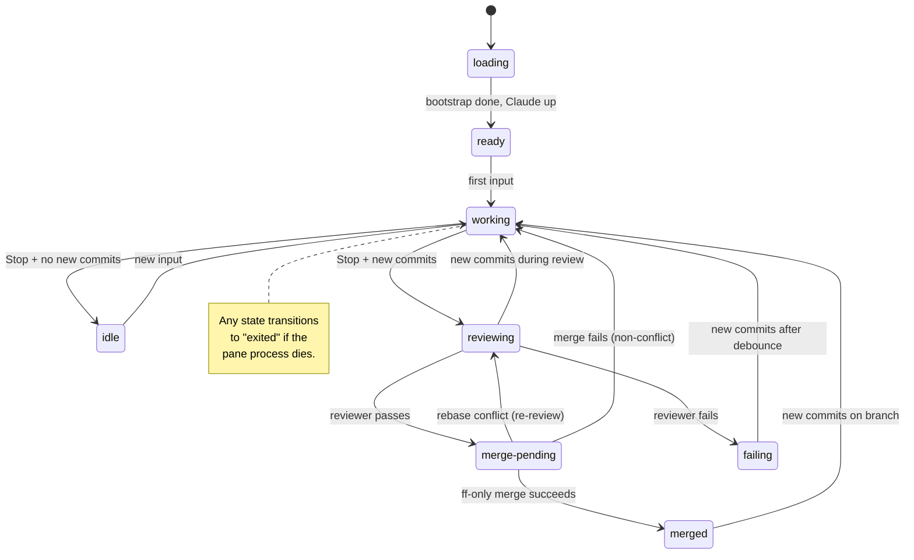
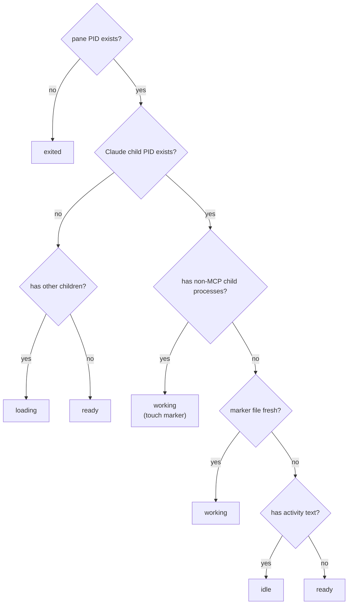
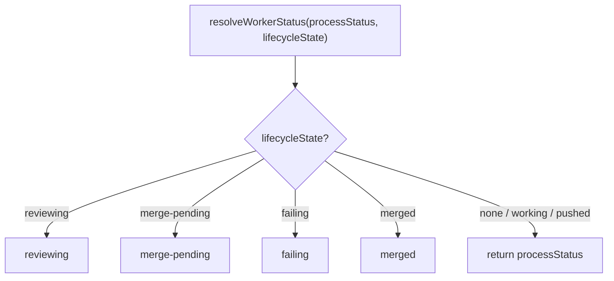
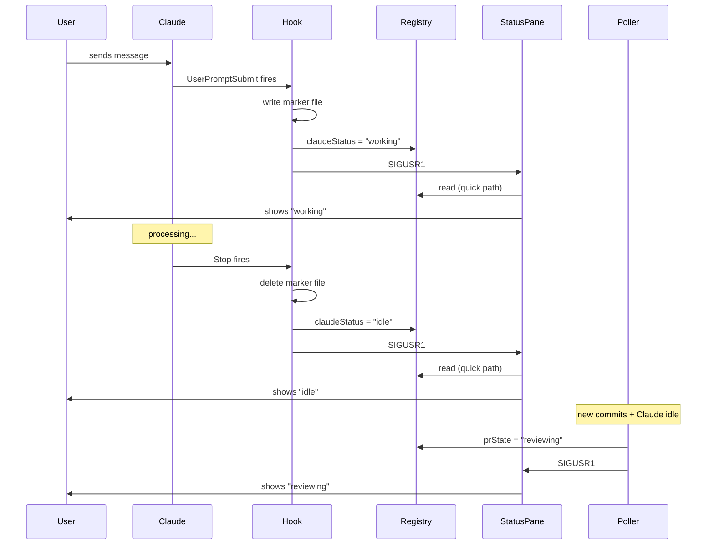

# Worker Status System

Spec for the worker status tracking and display system. This document is
the source of truth for how status works. **If the code disagrees with
this document, the code is wrong.**

## Display states

These are the only states the user sees in the status pane.

| State         | Icon | Meaning                                          |
|---------------|------|--------------------------------------------------|
| loading       | `H`  | Worker pane started, bootstrap running, Claude not yet launched. |
| ready         | `*`  | Fresh worker. Claude loaded, waiting for first input. |
| working       | `@`  | Claude is generating a response to a submitted prompt. See "What 'working' means" below. |
| idle          | `#`  | Claude is at the prompt. Ball is in the user's court — waiting for input, permission, or has an answer to read. Not in the review cycle. |
| reviewing     | `%`  | Automated reviewer is checking the worker's code. |
| merge-pending | `&`  | Review passed. Queued for merge.                 |
| merged        | `+`  | Code landed on the base branch.                  |
| failing       | `x`  | Review failed. Waiting for worker to fix.        |
| exited        | `o`  | Worker process is gone.                          |

(Icons shown here are placeholders. Actual Unicode symbols are defined in
`src/commands/status.ts`.)

### What "working" means

`working` means exactly one thing: **Claude has received a submitted
prompt and has not yet finished its response.**

It starts the instant the `UserPromptSubmit` hook fires and ends the
instant the `Stop` hook fires. Nothing else flips it.

Things that *are* working:
- Generating tokens
- Running tools (Read, Bash, Edit, etc.)
- Calling subagents
- Thinking between tool calls

Things that are *not* working:
- The user typing a message at the prompt (no prompt has been submitted yet)
- The user reading Claude's last response
- Claude sitting at the prompt with nothing to do
- The session being open in a pane the user isn't looking at

If a worker shows `working` while you're still typing into it, that is a
bug — the previous `Stop` hook didn't fire or didn't reach the registry.

## State transitions

The two exits from `working` are the core branching point:
- **No new commits** → `idle` (ball in user's court)
- **New commits** → `reviewing` (skips idle, enters review cycle)

### Transition rules

| From          | To            | Trigger                                              |
|---------------|---------------|------------------------------------------------------|
| loading       | ready         | Bootstrap finishes, Claude is up                     |
| ready         | working       | First `UserPromptSubmit`                             |
| working       | idle          | `Stop` fires; no new commits ahead of base branch    |
| working       | reviewing     | `Stop` fires; new commits ahead of base branch       |
| idle          | working       | `UserPromptSubmit`                                   |
| reviewing     | merge-pending | Reviewer verdict CLEAN or FIXED                      |
| reviewing     | failing       | Reviewer verdict FAILED                              |
| reviewing     | working       | New commits appear during review (review aborted)    |
| merge-pending | merged        | Fast-forward merge succeeds                          |
| merge-pending | reviewing     | Rebase conflict (scoped re-review launched)          |
| merge-pending | working       | Merge fails (non-conflict)                           |
| merged        | working       | New commits on the branch (poller detects via SHA)   |
| failing       | working       | New commits after 30s debounce                       |
| any           | exited        | Pane process is gone                                 |

A worker never returns to `ready` once it has received its first input.

## Key invariants

1. **`idle` and the review cycle are mutually exclusive.** A worker in
   `reviewing`, `merge-pending`, or `failing` never shows `idle`. If it
   shows `idle`, it is not in the review cycle.

2. **`working` is the only entry point to the review cycle.** The poller
   only transitions to `reviewing` when Claude stops working *and* new
   commits exist. You cannot go from `idle` directly to `reviewing`.

3. **`ready` is one-time.** Once a worker receives its first input, it
   never returns to `ready`.

4. **Lifecycle states are sticky.** A worker stays `merged` even if
   Claude is actively answering a question, until new commits appear on
   the branch. The lifecycle state tells the user where the *code* is,
   not what Claude is doing. Each merge cycle is independent —
   `mergeCount` in the registry tracks how many times a worker has gone
   through the full cycle, and the display shows "merged (x3)" etc.

5. **`pushed` is never displayed.** It is an internal poller term that
   resolves to either `working` (Claude still going) or `reviewing`
   (Claude stopped). The window between "Claude stopped" and "reviewer
   launched" is sub-second and not user-visible.

## Detection machinery

Status detection answers one question: **is Claude currently processing?**
Everything else is derived from that answer plus the poller's lifecycle
tracking.

### Signal sources (ordered by authority)

1. **Hooks** (highest authority): Claude Code fires `UserPromptSubmit`
   when processing starts and `Stop` when it finishes. These are the
   authoritative signals for working/idle transitions.
2. **Marker files** (`~/.garden/sessions/claude-active-<project>-<worker>`):
   the hooks write/delete the marker. Process detection reads it without
   re-querying hooks. mtime is touched when tool subprocesses are
   detected, so staleness measures "time since last tool activity," not
   "time since prompt."
3. **pgrep child detection**: detects whether Claude has active tool
   subprocesses. Confirms working state and touches the marker mtime.
   Cannot detect in-process work (subagents, API calls) — that is why
   the marker exists.
4. **Registry cache** (`claudeStatus`, lowest authority): last-known
   process status. Used by the quick render path for instant display. May
   be stale; the next full render corrects it.

### Detection function

`detectPaneProcessStatus(paneId, project, worker)` returns a `ProcessStatus`:

### Two render paths

- **Full render** (`garden status` / `printHeader`): live `pgrep`
  detection. Writes the result to registry `claudeStatus`. Accurate but
  costs a pgrep call per worker.
- **Quick render** (`renderQuickStatus`): reads `claudeStatus` from the
  registry. No detection. Used for instant visual feedback after
  mutations (new/kill worker, project switch). The next full render
  corrects any staleness.

### Display resolution

`resolveWorkerStatus(processStatus, lifecycleState)` combines the two:

Lifecycle states (`reviewing`, `merge-pending`, `failing`, `merged`)
take priority because they represent pipeline stages that don't depend
on what Claude is doing right now. A merged worker shows `merged` even
if Claude is actively answering a question — until new commits appear
on the branch, at which point `prState` transitions to `working` and
the display falls through to `processStatus`.

### Marker file lifecycle

The marker bridges the gap between hooks (which fire at the right time)
and process detection (which runs on demand).

- **Created**: `UserPromptSubmit` hook, written by `handleClaudeHook("prompt")`.
- **Touched**: by `detectPaneProcessStatus` whenever it finds active
  non-MCP child processes. mtime then measures "time since last tool
  activity."
- **Deleted**: `Stop` hook, removed by `handleClaudeHook("stop")`.
- **Stale expiry**: marker older than `MARKER_STALE_MS` (2 minutes) is
  treated as gone. Catches Claude crashes that skip the `Stop` hook. The
  threshold balances long subagent runs (must not expire mid-work) and
  prompt cleanup of stuck markers.

### Hook → display pipeline

## Known edge cases

**Subagent work with no tool calls.** Claude can spend minutes on
in-process subagent work (API calls, planning) with no child processes.
The marker file keeps the status as `working` during this time. If a
2-minute gap accumulates without any tool subprocess, status briefly
flickers to `idle` before the next tool call recreates a subprocess and
flips it back. Acceptable — a 2-minute gap with zero activity is unusual.

**Reviewer launched between keystrokes.** The poller checks
`isWorkerWorking()` before launching a review. If Claude happens to be
idle between rapid-fire messages, the poller might launch a review
prematurely. The review will be aborted if new commits appear during it.
