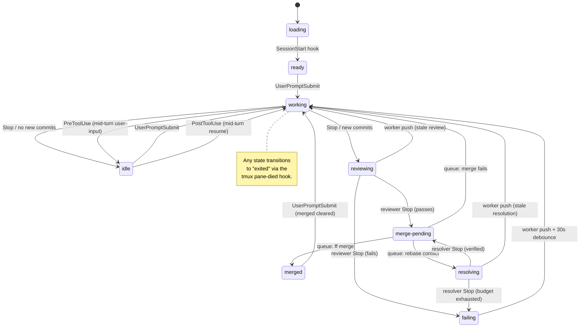
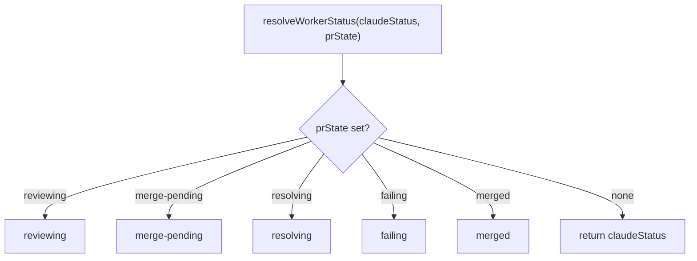
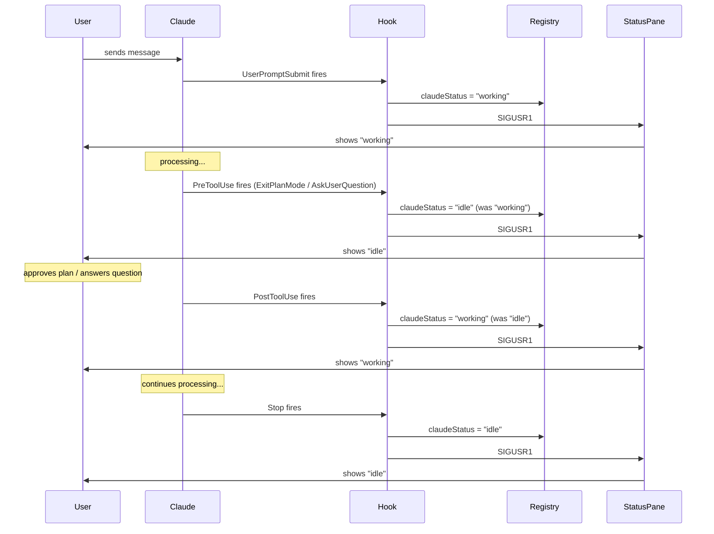

# Worker Status System

Spec for the worker status tracking and display system. This document is
the source of truth for how status works. **If the code disagrees with
this document, the code is wrong.** Past regressions came from racing
pgrep, marker files, and fallback polls; the model below is purely
event-driven and the implementation must stay that way.

## Display states

These are the only states the user sees in the status pane.

| State         | Icon | Meaning                                          |
|---------------|------|--------------------------------------------------|
| loading       | `H`  | Worker pane started, bootstrap running, Claude not yet launched. |
| ready         | `*`  | Fresh worker. Claude loaded, waiting for first input. |
| working       | `@`  | Claude is generating a response to a submitted prompt. See "What 'working' means" below. |
| idle          | `#`  | Ball is in the user's court — Claude is at the prompt, waiting for plan approval, answering a question, or has a response to read. Not in the review cycle. |
| reviewing     | `%`  | Automated reviewer is checking the worker's code. |
| merge-pending | `&`  | Review passed. Queued for merge.                 |
| resolving     | `~`  | Automated resolver is fixing a merge-queue rebase conflict. |
| merged        | `+`  | Code landed on the base branch.                  |
| failing       | `x`  | Review failed. Waiting for worker to fix.        |
| exited        | `o`  | Worker process is gone.                          |

(Icons shown here are placeholders. Actual Unicode symbols are defined in
`src/commands/status.ts`.)

### What "working" means

`working` means exactly one thing: **Claude has received a submitted
prompt and has not yet finished its response.**

It starts the instant the `UserPromptSubmit` hook fires and ends the
instant the `Stop` hook fires. Nothing else flips it.

Things that *are* working:
- Generating tokens
- Running tools (Read, Bash, Edit, etc.)
- Calling subagents
- Thinking between tool calls

Things that are *not* working:
- The user typing a message at the prompt (no prompt has been submitted yet)
- The user reading Claude's last response
- Claude sitting at the prompt with nothing to do
- The session being open in a pane the user isn't looking at
- Claude waiting for the user to approve a plan or answer a question (mid-turn idle)

If a worker shows `working` while Claude is waiting for user input, that
is a bug — the PreToolUse hook for the blocking tool (`ExitPlanMode`,
`AskUserQuestion`) didn't fire or didn't reach the registry.

## State transitions



The two exits from `working` are the core branching point:
- **No new commits** → `idle` (ball in user's court)
- **New commits** → `reviewing` (skips idle, enters review cycle)

### Transition rules

| From          | To            | Trigger event                                        |
|---------------|---------------|------------------------------------------------------|
| loading       | ready         | Worker `SessionStart` hook                           |
| ready         | working       | Worker `UserPromptSubmit` (first)                    |
| working       | idle          | Worker `Stop`; no new commits ahead of base          |
| working       | idle          | Worker `PreToolUse` (mid-turn user-input tool)       |
| working       | reviewing     | Worker `Stop`; new commits ahead of base             |
| idle          | working       | Worker `UserPromptSubmit`                            |
| idle          | working       | Worker `PostToolUse` (mid-turn resume)               |
| reviewing     | merge-pending | Reviewer `Stop` with verdict CLEAN or FIXED          |
| reviewing     | failing       | Reviewer `Stop` with verdict FAILED                  |
| reviewing     | working       | Worker push event (commits during review, aborted)   |
| merge-pending | merged        | Merge queue: ff merge succeeds                       |
| merge-pending | resolving     | Merge queue: rebase conflict (resolver launched)     |
| merge-pending | working       | Merge queue: merge fails (non-conflict)              |
| resolving     | merge-pending | Resolver `Stop`, programmatic verification passed    |
| resolving     | failing       | Resolver `Stop`, budget exhausted or verification failed |
| resolving     | working       | Worker push event (commits during resolution, aborted) |
| merged        | working       | Worker `UserPromptSubmit` (merged cleared)           |
| failing       | working       | Worker push event + 30s debounce                     |
| any           | exited        | tmux `pane-died` hook                                |

A worker never returns to `ready` once it has received its first input.

## How transitions are detected

Every transition above is delivered by an identifiable event from a
specific source. **There is no recurring tick. There is no fallback
poll. There is no "let's check just in case."** The poller is a pure
dispatcher: it wakes when an event arrives, runs one unit of work, and
goes back to sleep.

### Event sources

Four sources cover the entire state machine.

**1. Claude Code hooks** — `SessionStart`, `UserPromptSubmit`, `Stop`,
`PreToolUse`, `PostToolUse`.

These bracket the lifecycle of every Claude conversation and fire from
*every* Claude process: workers, reviewers, helpers. The hooks call
`garden dashboard _claude-hook <event>`, which updates the registry and
signals the status pane. They drive:

- `loading → ready` (worker's `SessionStart`)
- `ready → working`, `idle → working`, `merged → working` (worker's `UserPromptSubmit`)
- `working → idle`, `working → reviewing` (worker's `Stop`)
- `working → idle` (worker's `PreToolUse` for user-input tools)
- `idle → working` (worker's `PostToolUse` for user-input tools)
- `reviewing → merge-pending`, `reviewing → failing` (reviewer's `Stop`)
- `resolving → merge-pending`, `resolving → failing` (resolver's `Stop`)

The worker's `Stop` hook also pokes the project's poller FIFO if it sees
new commits ahead of the base branch — so review starts immediately,
without waiting for any tick.

**2. Worker push events** — a worker's `git push` completion pokes its
project's poller FIFO via a pre-push hook installed in each worktree.
The push is the event; the poke is the delivery.

Drives:

- `reviewing → working` (commits arrive during review, review aborted)
- `resolving → working` (commits arrive during resolution, resolver aborted)
- `failing → working` (after the 30s debounce starts on the push)

**3. Merge queue completion** — an internal in-process event. When one
merge finishes, the next item in the project's serial queue is processed.
No external trigger.

Drives:

- `merge-pending → merged`
- `merge-pending → resolving` (rebase conflict)
- `merge-pending → working` (merge fails for a non-conflict reason)
- `resolving → merge-pending` (resolver succeeded and verification passed)
- `resolving → failing` (resolver budget exhausted or verification failed)

**4. tmux `pane-died` hook** — tmux fires this automatically when a
pane process exits. The dashboard listens and writes
`claudeStatus = "exited"` to the registry.

Drives:

- `any → exited`

### The only timer

The 30-second `failing → working` debounce is the *only* timer in the
system. It is a deliberate hold-off — preventing review storms on a
worker that's actively failing in a tight loop — not a discovery
mechanism. The timer starts on a push event, not on a tick. When the
poller detects new commits in a failing worker, it schedules a one-shot
delayed FIFO poke (via a detached `sleep N && echo > fifo` process) so
the debounce check fires after 30 seconds. This is not a recurring
poll — it is a single scheduled event tied to a specific state
transition.

### Why this matters

A bug in this system is always a bug in event plumbing — never "the
poller didn't tick fast enough." There is no tick. If a transition
isn't reached, exactly one event was missed, and there is exactly one
place to look for it. This is what makes the state machine resistant to
the kind of timing-based regressions that have hit it in the past, and
why this spec rejects any code change that introduces a `setInterval`,
recurring re-check, or "fallback poll."

## Key invariants

1. **`idle` and the review cycle are mutually exclusive.** A worker in
   `reviewing`, `merge-pending`, `resolving`, or `failing` never shows
   `idle`. If it shows `idle`, it is not in the review cycle.

2. **`working` is the only entry point to the review cycle.** The poller
   only transitions to `reviewing` when Claude stops working *and* new
   commits exist. You cannot go from `idle` directly to `reviewing`.

3. **`ready` is one-time.** Once a worker receives its first input, it
   never returns to `ready`.

4. **Active pipeline states are sticky; `merged` is not.** While a worker
   is in `reviewing`, `merge-pending`, `resolving`, or `failing`, those
   states take priority over what Claude is doing — they represent
   in-progress pipeline work. `merged` persists only until the worker
   receives new input, then clears immediately. There is no "merged
   history" — each cycle is independent. Race case: if the worker
   received new input while the merge cycle was in progress, the prompt
   hook cannot clear "merged" (because prState was still an active
   pipeline state at prompt time). `finalizeMerge` handles this by
   checking `claudeStatus` after setting "merged" — if the worker is
   already working, it transitions immediately to "working".

5. **There is no `pushed` state.** Earlier versions of this system carried
   an internal `pushed` lifecycle state between "commits exist" and
   "reviewer launched". The current model collapses that gap: the worker's
   Stop hook sets `pendingReviewAt` (and pokes the poller FIFO) the moment
   it observes commits ahead of base, and the poller's next wake transitions
   the worker directly to `reviewing`. The window is sub-second and not
   user-visible. `pushed` does not appear in the registry, the renderer,
   or the type system.

6. **Every transition is event-triggered.** No transition is discovered
   by a recurring tick or fallback poll. The poller wakes only when
   poked by an event (a hook firing, a worker pushing, a reviewer
   exiting, a merge queue item completing) and does one unit of work.
   The 30-second `failing → working` debounce is the only timer in the
   system, and it is a deliberate hold-off, not a discovery mechanism.

7. **Resolver verdicts are not trusted — they are verified.** When a
   resolver returns a `DONE` verdict, the poller does not transition to
   `merge-pending` on the strength of the text alone. It runs three
   programmatic checks against the worktree: no rebase is in progress
   (`.git/rebase-merge` and `.git/rebase-apply` are absent),
   `origin/<base>` is an ancestor of local HEAD, and HEAD differs from
   `preResolveSha`. All three must pass. If any fails, the attempt
   counts as a failed resolution regardless of the verdict text. This
   invariant exists because Claude can (and has) declared success
   without completing the rebase — the spec makes verification the
   contract, not trust.

8. **Resolver retries have a fixed budget.** `resolveAttempts` on the
   worker entry caps the number of resolver launches per merge attempt
   at 2 (one initial + one retry). When the budget is exhausted, the
   worker transitions to `failing` and a persistent operator alert is
   raised. Budget resets to 0 on any worker-authored push (new commits
   on the branch) or on successful merge. Workers cannot silently spin
   on an unresolvable conflict.

## Detection machinery

The status of every worker is two fields in the registry: `claudeStatus`
and `prState`. There are exactly four writers and one reader. There is
no `pgrep`, no marker file, no activity-text parsing, no fallback poll.

### Writers

**Worker creation** writes `claudeStatus = "loading"` when `newWorker()`
spawns the worker pane.

**Claude Code hooks** write `claudeStatus`. The hooks fire from every
Claude process and call `garden dashboard _claude-hook <event>`:

- `SessionStart` → `claudeStatus = "ready"`
- `UserPromptSubmit` → `claudeStatus = "working"`. Also clears `prState`
  if it equals `merged` (this is the only place `merged` is cleared).
- `Stop` → `claudeStatus = "idle"`. If commits ahead of base exist, also
  sets `pendingReviewAt = Date.now()` and pokes the project's poller FIFO
  so review begins immediately. `pendingReviewAt` is the per-worker mark
  that the Stop hook just observed new commits — without it, the poller
  cannot tell "Stop hook just fired" from "worker has been idle with
  stale commits for a month" and would spuriously review old branches.
  This is what makes invariant 2 enforceable: only Stop sets the flag,
  only the poller's working→reviewing transition reads it, and
  `launchReview` clears it.
- `PreToolUse` (matched to `AskUserQuestion`, `ExitPlanMode`) →
  `claudeStatus = "idle"` (only if currently `working`). Fires when
  Claude is about to execute a tool that requires user input.
  `ExitPlanMode` is the blocking tool — it presents the plan for user
  approval. `EnterPlanMode` is non-blocking (Claude entering plan mode
  to write the plan) and must NOT be hooked, as its PreToolUse/PostToolUse
  fire during active generation and would cause spurious working↔idle
  flicker. The `Notification` hook is not used — it matches too broadly
  (all notification types, not just user-attention ones) and the
  user-input cases are fully covered by PreToolUse/PostToolUse on the
  specific tools.
- `PermissionRequest` (no matcher — all tools) →
  `claudeStatus = "idle"` (only if currently `working`), plus a
  "worker needs your input" operator alert. Fires when auto-mode's
  classifier escalates a tool call for operator approval — it is the
  only event that reports "a permission dialog is actually being shown"
  (unlike `PreToolUse`, which fires for every tool call and would
  flicker the dashboard on every auto-approved bash). Workers launch
  with `claude --enable-auto-mode` so this hook is the one-stop signal
  for operator-attention-required events across every tool, not just
  Bash.
- `PostToolUse` (matched to `AskUserQuestion`, `ExitPlanMode`, `Bash`) →
  `claudeStatus = "working"` (only if currently `idle`). Fires when
  the user has responded and Claude resumes processing. The `Bash`
  match is what restores `working` after the operator approves an
  auto-mode permission prompt — without it the worker would stay stuck
  at `idle` for the rest of the turn.

**The poller** writes `prState` in response to the events documented in
"How transitions are detected." The poller is the only writer of
in-progress lifecycle states (`reviewing`, `merge-pending`, `failing`,
`merged`).

**The tmux `pane-died` handler** writes `claudeStatus = "exited"` when
a worker pane process exits.

### Reader

The status renderer reads `claudeStatus` and `prState` from the registry
and combines them with `resolveWorkerStatus()`. There is exactly one
render path. The renderer never executes `pgrep`, never reads a marker
file, never parses activity text. If the registry says a worker is
working, it is working — full stop.

### resolveWorkerStatus



Lifecycle states (`reviewing`, `merge-pending`, `resolving`, `failing`,
`merged`) take priority because they describe where the worker's *code*
is, not what Claude is doing right now. `merged` is the only one that
clears on `UserPromptSubmit` — that clear is performed by the hook
handler, not by this combine function.

### Hook → display pipeline

```mermaid
sequenceDiagram
    participant User
    participant Claude
    participant Hook
    participant Registry
    participant StatusPane

    User->>Claude: sends message
    Claude->>Hook: UserPromptSubmit fires
    Hook->>Registry: claudeStatus = "working"; clear prState if "merged"
    Hook->>StatusPane: SIGUSR1
    StatusPane->>Registry: read claudeStatus + prState
    StatusPane->>User: shows "working"

    Note over Claude: processing...

    Claude->>Hook: Stop fires
    Hook->>Registry: claudeStatus = "idle"
    Hook->>StatusPane: SIGUSR1
    StatusPane->>User: shows "idle"
```

#### Mid-turn idle (plan mode, questions)



## Known edge cases

The legacy implementation had several edge cases driven by its
heuristic detection (subagent flicker, race between pgrep and hooks,
marker staleness). All of those go away in the event-driven model
because there is no detection — only event delivery.

The remaining failure modes are honest:

**Hook fails to fire.** If Claude crashes or Claude Code's hook plumbing
is broken, `claudeStatus` is not updated and the worker shows its last
known state. The `garden health` command detects workers whose hooks
haven't fired in an unusually long time and surfaces them to the user.
We do not auto-correct via fallback polling — that mechanism is the
exact source of the regressions this spec is meant to prevent.

**tmux `pane-died` hook missed.** If tmux fails to fire `pane-died`, an
exited worker continues to show its previous status until the next
explicit interaction. The `garden health` command detects panes whose
PIDs no longer exist and corrects the registry.
