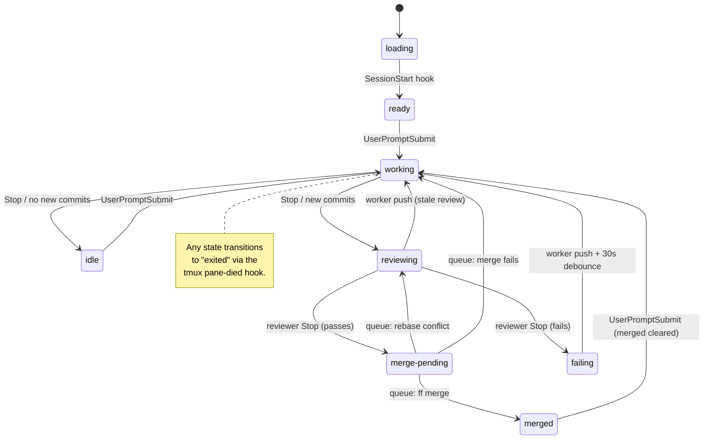
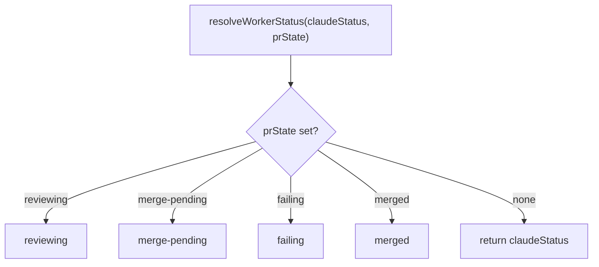

# Worker Status System

Spec for the worker status tracking and display system. This document is
the source of truth for how status works. **If the code disagrees with
this document, the code is wrong.** The current implementation contains
historical fallbacks and heuristics that this spec rejects — they are
the source of past regressions and will be removed.

## Display states

These are the only states the user sees in the status pane.

| State         | Icon | Meaning                                          |
|---------------|------|--------------------------------------------------|
| loading       | `H`  | Worker pane started, bootstrap running, Claude not yet launched. |
| ready         | `*`  | Fresh worker. Claude loaded, waiting for first input. |
| working       | `@`  | Claude is generating a response to a submitted prompt. See "What 'working' means" below. |
| idle          | `#`  | Claude is at the prompt. Ball is in the user's court — waiting for input, permission, or has an answer to read. Not in the review cycle. |
| reviewing     | `%`  | Automated reviewer is checking the worker's code. |
| merge-pending | `&`  | Review passed. Queued for merge.                 |
| merged        | `+`  | Code landed on the base branch.                  |
| failing       | `x`  | Review failed. Waiting for worker to fix.        |
| exited        | `o`  | Worker process is gone.                          |

(Icons shown here are placeholders. Actual Unicode symbols are defined in
`src/commands/status.ts`.)

### What "working" means

`working` means exactly one thing: **Claude has received a submitted
prompt and has not yet finished its response.**

It starts the instant the `UserPromptSubmit` hook fires and ends the
instant the `Stop` hook fires. Nothing else flips it.

Things that *are* working:
- Generating tokens
- Running tools (Read, Bash, Edit, etc.)
- Calling subagents
- Thinking between tool calls

Things that are *not* working:
- The user typing a message at the prompt (no prompt has been submitted yet)
- The user reading Claude's last response
- Claude sitting at the prompt with nothing to do
- The session being open in a pane the user isn't looking at

If a worker shows `working` while you're still typing into it, that is a
bug — the previous `Stop` hook didn't fire or didn't reach the registry.

## State transitions



The two exits from `working` are the core branching point:
- **No new commits** → `idle` (ball in user's court)
- **New commits** → `reviewing` (skips idle, enters review cycle)

### Transition rules

| From          | To            | Trigger event                                        |
|---------------|---------------|------------------------------------------------------|
| loading       | ready         | Worker `SessionStart` hook                           |
| ready         | working       | Worker `UserPromptSubmit` (first)                    |
| working       | idle          | Worker `Stop`; no new commits ahead of base          |
| working       | reviewing     | Worker `Stop`; new commits ahead of base             |
| idle          | working       | Worker `UserPromptSubmit`                            |
| reviewing     | merge-pending | Reviewer `Stop` with verdict CLEAN or FIXED          |
| reviewing     | failing       | Reviewer `Stop` with verdict FAILED                  |
| reviewing     | working       | Worker push event (commits during review, aborted)   |
| merge-pending | merged        | Merge queue: ff merge succeeds                       |
| merge-pending | reviewing     | Merge queue: rebase conflict (re-review launched)    |
| merge-pending | working       | Merge queue: merge fails (non-conflict)              |
| merged        | working       | Worker `UserPromptSubmit` (merged cleared)           |
| failing       | working       | Worker push event + 30s debounce                     |
| any           | exited        | tmux `pane-died` hook                                |

A worker never returns to `ready` once it has received its first input.

## How transitions are detected

Every transition above is delivered by an identifiable event from a
specific source. **There is no recurring tick. There is no fallback
poll. There is no "let's check just in case."** The poller is a pure
dispatcher: it wakes when an event arrives, runs one unit of work, and
goes back to sleep.

### Event sources

Four sources cover the entire state machine.

**1. Claude Code hooks** — `SessionStart`, `UserPromptSubmit`, `Stop`.

These bracket the lifecycle of every Claude conversation and fire from
*every* Claude process: workers, reviewers, helpers. The hooks call
`garden dashboard _claude-hook <event>`, which updates the registry and
signals the status pane. They drive:

- `loading → ready` (worker's `SessionStart`)
- `ready → working`, `idle → working`, `merged → working` (worker's `UserPromptSubmit`)
- `working → idle`, `working → reviewing` (worker's `Stop`)
- `reviewing → merge-pending`, `reviewing → failing` (reviewer's `Stop`)

The worker's `Stop` hook also pokes the project's poller FIFO if it sees
new commits ahead of the base branch — so review starts immediately,
without waiting for any tick.

**2. Worker push events** — a worker's `git push` completion pokes its
project's poller FIFO via a pre-push hook installed in each worktree.
The push is the event; the poke is the delivery.

Drives:

- `reviewing → working` (commits arrive during review, review aborted)
- `failing → working` (after the 30s debounce starts on the push)

**3. Merge queue completion** — an internal in-process event. When one
merge finishes, the next item in the project's serial queue is processed.
No external trigger.

Drives:

- `merge-pending → merged`
- `merge-pending → reviewing` (rebase conflict)
- `merge-pending → working` (merge fails for a non-conflict reason)

**4. tmux `pane-died` hook** — tmux fires this automatically when a
pane process exits. The dashboard listens and writes
`claudeStatus = "exited"` to the registry.

Drives:

- `any → exited`

### The only timer

The 30-second `failing → working` debounce is the *only* timer in the
system. It is a deliberate hold-off — preventing review storms on a
worker that's actively failing in a tight loop — not a discovery
mechanism. The timer starts on a push event, not on a tick.

### Why this matters

A bug in this system is always a bug in event plumbing — never "the
poller didn't tick fast enough." There is no tick. If a transition
isn't reached, exactly one event was missed, and there is exactly one
place to look for it. This is what makes the state machine resistant to
the kind of timing-based regressions that have hit it in the past, and
why this spec rejects any code change that introduces a `setInterval`,
recurring re-check, or "fallback poll."

## Key invariants

1. **`idle` and the review cycle are mutually exclusive.** A worker in
   `reviewing`, `merge-pending`, or `failing` never shows `idle`. If it
   shows `idle`, it is not in the review cycle.

2. **`working` is the only entry point to the review cycle.** The poller
   only transitions to `reviewing` when Claude stops working *and* new
   commits exist. You cannot go from `idle` directly to `reviewing`.

3. **`ready` is one-time.** Once a worker receives its first input, it
   never returns to `ready`.

4. **Active pipeline states are sticky; `merged` is not.** While a worker
   is in `reviewing`, `merge-pending`, or `failing`, those states take
   priority over what Claude is doing — they represent in-progress
   pipeline work. `merged` persists only until the worker receives new
   input, then clears immediately. There is no "merged history" — each
   cycle is independent.

5. **`pushed` is never displayed.** It is an internal poller term that
   resolves to either `working` (Claude still going) or `reviewing`
   (Claude stopped). The window between "Claude stopped" and "reviewer
   launched" is sub-second and not user-visible.

6. **Every transition is event-triggered.** No transition is discovered
   by a recurring tick or fallback poll. The poller wakes only when
   poked by an event (a hook firing, a worker pushing, a reviewer
   exiting, a merge queue item completing) and does one unit of work.
   The 30-second `failing → working` debounce is the only timer in the
   system, and it is a deliberate hold-off, not a discovery mechanism.

## Detection machinery

The status of every worker is two fields in the registry: `claudeStatus`
and `prState`. There are exactly four writers and one reader. There is
no `pgrep`, no marker file, no activity-text parsing, no fallback poll.

### Writers

**Worker creation** writes `claudeStatus = "loading"` when `newWorker()`
spawns the worker pane.

**Claude Code hooks** write `claudeStatus`. The hooks fire from every
Claude process and call `garden dashboard _claude-hook <event>`:

- `SessionStart` → `claudeStatus = "ready"`
- `UserPromptSubmit` → `claudeStatus = "working"`. Also clears `prState`
  if it equals `merged` (this is the only place `merged` is cleared).
- `Stop` → `claudeStatus = "idle"`. If commits ahead of base exist, also
  pokes the project's poller FIFO so review begins immediately.

**The poller** writes `prState` in response to the events documented in
"How transitions are detected." The poller is the only writer of
in-progress lifecycle states (`reviewing`, `merge-pending`, `failing`,
`merged`).

**The tmux `pane-died` handler** writes `claudeStatus = "exited"` when
a worker pane process exits.

### Reader

The status renderer reads `claudeStatus` and `prState` from the registry
and combines them with `resolveWorkerStatus()`. There is exactly one
render path. The renderer never executes `pgrep`, never reads a marker
file, never parses activity text. If the registry says a worker is
working, it is working — full stop.

### resolveWorkerStatus



Lifecycle states (`reviewing`, `merge-pending`, `failing`, `merged`)
take priority because they describe where the worker's *code* is, not
what Claude is doing right now. `merged` is the only one that clears on
`UserPromptSubmit` — that clear is performed by the hook handler, not
by this combine function.

### Hook → display pipeline

```mermaid
sequenceDiagram
    participant User
    participant Claude
    participant Hook
    participant Registry
    participant StatusPane

    User->>Claude: sends message
    Claude->>Hook: UserPromptSubmit fires
    Hook->>Registry: claudeStatus = "working"; clear prState if "merged"
    Hook->>StatusPane: SIGUSR1
    StatusPane->>Registry: read claudeStatus + prState
    StatusPane->>User: shows "working"

    Note over Claude: processing...

    Claude->>Hook: Stop fires
    Hook->>Registry: claudeStatus = "idle"
    Hook->>StatusPane: SIGUSR1
    StatusPane->>User: shows "idle"
```

### Legacy mechanisms removed

The current implementation contains the following mechanisms, all of
which this spec rejects. They are listed here by name so that gut-and-
replace work can target them precisely. Until they are deleted, they
exist in the code but not in this spec — and the spec governs.

- **`pgrep` child process detection** in `src/dashboard/detect.ts`
  (`detectPaneProcessStatus`, `getClaudeChildPid`, `hasChildProcesses`,
  `hasNonMcpChildren`). Today's primary signal for working/idle/loading.
  Replaced by hooks-only writes to the registry.
- **Marker files** at `~/.garden/sessions/claude-active-<project>-<worker>`
  and the `MARKER_STALE_MS` (2-minute) expiry window in
  `src/dashboard/header.ts`. Created to bridge the gap between hooks
  and pgrep observations during in-process subagent work. With pgrep
  gone, no bridge is needed.
- **`HOOK_PRIORITY_MS` window** (5 seconds) in `src/dashboard/header.ts`
  and `src/commands/status.ts`. Created to defend hook-set values
  against pgrep-based writers that would otherwise race them. With
  pgrep gone, no defense is needed.
- **Activity-text parsing** from pane title and the `garden_task` pane
  variable in `src/dashboard/detect.ts`. Used as a tiebreaker when
  process-detection signals are inconclusive. Hooks make this redundant.
- **10-second fallback poll** in the poller's FIFO read loop
  (`startProjectPoller` in `src/dashboard/poller.ts`, `read -t 10`).
  Created as a safety net for missed events. The spec rejects safety-
  net polling — missed events must be diagnosed at their source, not
  papered over by re-checking on a timer.
- **`mergeCount` tracking** in the registry and any "merged (xN)"
  display rendering. Per invariant 4, there is no merged history; each
  cycle is independent.
- **The "two render paths" split** (full render vs quick render) in
  `src/dashboard/header.ts` and `src/commands/status.ts`. With process
  detection removed, both paths collapse into the same registry-read.
  There is one render path.

Each of these is a load-bearing piece of the legacy detection machinery
that has produced the regressions this spec is designed to eliminate.
The gut-and-replace work that follows this spec must remove all of them.

## Known edge cases

The legacy implementation had several edge cases driven by its
heuristic detection (subagent flicker, race between pgrep and hooks,
marker staleness). All of those go away in the event-driven model
because there is no detection — only event delivery.

The remaining failure modes are honest:

**Hook fails to fire.** If Claude crashes or Claude Code's hook plumbing
is broken, `claudeStatus` is not updated and the worker shows its last
known state. The `garden health` command detects workers whose hooks
haven't fired in an unusually long time and surfaces them to the user.
We do not auto-correct via fallback polling — that mechanism is the
exact source of the regressions this spec is meant to prevent.

**tmux `pane-died` hook missed.** If tmux fails to fire `pane-died`, an
exited worker continues to show its previous status until the next
explicit interaction. The `garden health` command detects panes whose
PIDs no longer exist and corrects the registry.
